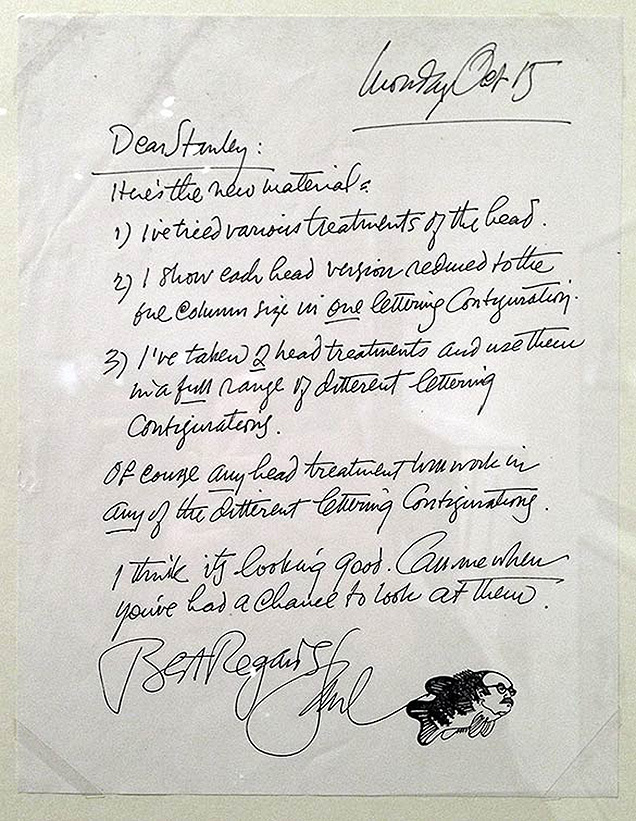

# Meer dan 300 mogelijke versies van de poster voor 'The Shining'
'The Shining' is een klassieker - niet alleen aan de film was veel werk, ook aan de filmposter. Er zijn zo'n 300 verschillende versies van gemaakt voor regisseur Stanley Kubrick eindelijk tevreden was.

Enkele van de voorstellen, met zijn commentaar erbij geschreven, vind je hieronder.

Op onderstaande foto's zie je een fragment uit de ellenlange briefwisseling tussen Kubrick en tekenaar Saul Bass.

Na meer dan 300 pogingen werd dit uiteindelijk de officiële poster: 

