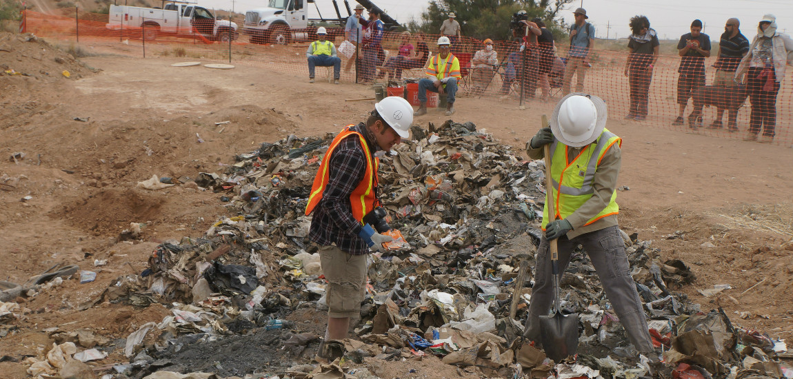

# Atari heeft miljoenen games begraven
In 1982 bracht gameproducent Atari het computerspel E.T. uit. Een langverwachte game na de populaire film – tenminste, dat hoopte Atari. Al snel bleek dat er toch niet zoveel vraag was… En nu zijn er miljoenen onverkochte discs van het spel gevonden, begraven op een ‘computerspelkerkhof’.

Atari had veel geïnvesteerd in dit spel – in ’82 was de film E.T. een gigantisch succes, en dat moest het spel dus ook worden. Helaas bleef de aandacht uit en bleef Atari dus zitten met een hele hoop onverkochte spellen.

De oplossing om geen gezichtsverlies te lijden? Miljoenen games begraven, blijkbaar. Atari kreeg de investeringen niet terug en heeft dus een enorm verlies geleden, maar de miljoenen onverkochte discs waren verdwenen. Tot nu dus.

Een cameraploeg is op zoek gegaan naar de verloren games, voor een documentaire gesponsord door Microsoft. Wanneer de documentaire uitkomt is nog niet duidelijk, maar de conclusie kennen we nu dus al wel. De cameraploeg schat dat ze zo’n 3,5 miljoen discs gevonden hebben op de begraafplaats in New Mexico, in de Verenigde Staten.

Trouwens, voor wie nu benieuwd is hoe dat gefaalde spel eruit ziet: hieronder vind je een playthrough!

<iframe width="100%" src="https://www.youtube.com/embed/EFt-La3UUu0" frameborder="0" allowfullscreen></iframe>