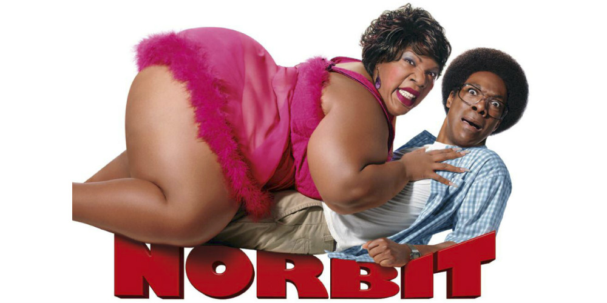

# Drie keer 'slechtste acteur' in één film
In de komedie ‘Norbit’ speelt Eddie Murphy drie verschillende rollen: het hoofdpersonage Norbit, zijn verloofde Rasputia, en de vader Mr. Wong. Deze prestatie is dan ook niet onopgemerkt voorbijgegaan… Murphy kreeg voor deze film drie keer de prijs voor slechtste acteur.

We kennen allemaal de Oscars, waarin de beste films van het jaar in de kijker worden gezet. Zo zijn er ook de Razzies – de omgekeerde Oscars. Elk jaar wordt dus een Razzie uitgereikt aan de slechtste films, de slechtste acteurs en de slechtste regisseurs.

In 2008 had Eddie Murphy dus wel heel veel pech. Hij mocht namelijk naar huis met drie Razzies: die van slechtste acteur, slechtste actrice en slechtste acteur in bijrol. De film ‘Norbit’ was duidelijk geen succes bij de critici. Murphy was ook nog genomineerd voor ‘slechtste koppel op het scherm’… samen met zichzelf dus.

De film bleef hem achtervolgen, want in 2010 mocht Murphy nog een Razzie ontvangen voor ‘slechtste acteur van het decennium’. Natuurlijk zijn zijn films altijd wel een groot succes bij het publiek, dus deze ‘prijzen’ zullen toch niet zo slecht zijn.