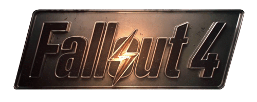

# 'Fallout 4 ruïneerde mijn leven!'
Een 28-jarige man uit Rusland is **enorm verslaafd geraakt aan de game Fallout 4.** Het werd zelfs zo erg dat hij Bethesda, de ontwikkelaar en uitgever van het spel, **wil aanklagen.** Want dankzij hen is zijn leven helemaal geruïneerd!

Geen grap: de man speelde het spel **drie weken aan een stuk.** Hij stopte alleen af en toe om te slapen. Hij werd **ontslagen op het werk** omdat hij niet kwam opdagen - _duh_ - en **zijn vrouw vertrok** omdat hij haar drie weken lang negeerde.

Allemaal de schuld van het spel, vindt de Rus. Eigenlijk wou hij het gewoon een paar avonden uitproberen, **maar hij wist niet dat het zo verslavend zou zijn.** Die waarschuwing zou dus toch echt op de verpakking moeten staan!

Voor al zijn lijden verwacht de man **een compensatie van 500.000 Russische roebel**, omgerekend zo'n 6700 euro. **Zijn advocaten zeggen dat ze 'wel zullen zien' wat ze kunnen krijgen...** Die hebben er dus duidelijk niet veel vertrouwen in. Laat het je vooral niet tegenhouden om Fallout 4 zelf te proberen, zolang je daarnaast ook gewoon je leven leidt!

<iframe width="100%" src="https://www.youtube.com/embed/GE2BkLqMef4" frameborder="0" allowfullscreen></iframe>