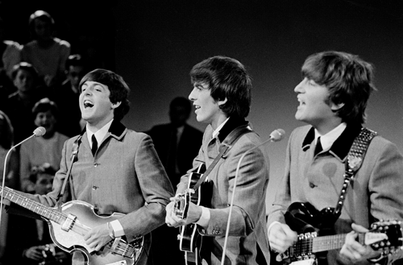

# 'Life of Brian', betaald door The Beatles
**Monty Python's Life of Brian**, de satirische film over de geboorte en het leven van Christus, zou er nooit geweest zijn **zonder The Beatles.**

Filmstudio **EMI Films** zou normaal voor het geld zorgen om de legendarische film uit 1979 te produceren, maar trok zich plots terug. Gelukkig was daar **George Harrison**: ex-gitarist van The Beatles, stinkend rijk en **grote fan van Monty Python.** Hij bood zijn portefeuille aan om te film te financieren via zijn bedrijf HandMade Films.

Het feit dat John Cleese en co Life of Brian hebben kunnen maken _- en wij ervan kunnen genieten -_ hebben we dus allemaal te danken aan het grote succes van The Beatles. Dankzij dat succes had Harrison natuurlijk een goed gevulde portefeuille!