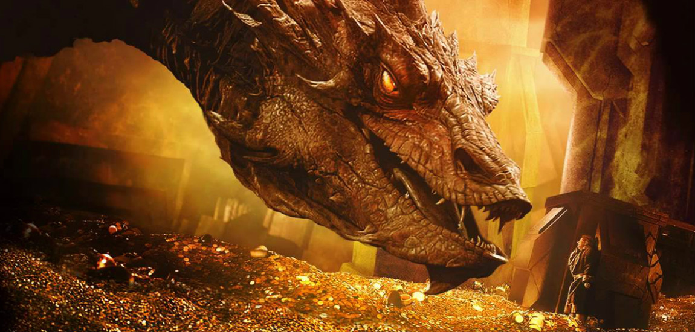

# De allerrijkste fictieve personages
Forbes maakt om de paar jaar een lijst van de rijkste fictieve personages. De laatste lijst dateert van 2013 en op de eerste plaats vinden we... **Dagobert Duck**, de stinkend rijke eendenoom van Disney!

Zijn vermogen werd geschat op 65,4 miljard dollar. Niet moeilijk, want hij zwemt letterlijk in het geld.

Het zilver gaat naar **Smaug** uit The Hobbit van J.R.R. Tolkien, goed voor zo'n 54,1 miljard dollar. Ook niet meteen een verrassing, want Smaug woont gewoon op een berg geld en schatten.

Misschien wel een verrassing: de top drie wordt aangevuld door **Carlisle Cullen**, de vader van Edward in de Twilight-trilogie. De vampierenfamilie zou zo'n 46 miljard dollar waard zijn.

Wie we wél in deze lijst hadden verwacht: **Tony Stark**, aka Iron Man, staat op plaats vier met 12,4 miljard dollar; Batman **Bruce Wayne** is pas de zesde rijkste met 9,2 miljard dollar.