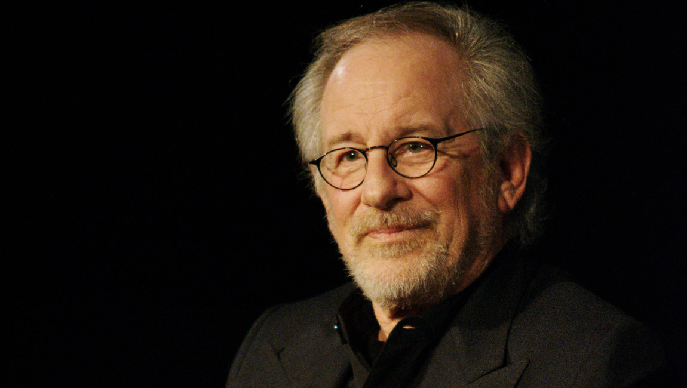

# Steven Spielberg was doodsbang van 'Paranormal Activity'
Ofwel ben je fan van ['Paranormal Activity'](https://www.imdb.com/title/tt1179904/), ofwel helemaal niet. De horrorfilm uit 2007 wordt door velen 'de engste film ooit' genoemd, anderen vinden er niks aan. Regisseur Steven Spielberg zit alvast in de eerste categorie.

Spielberg moest beslissen of hij 'Paranormal Activity' wou uitbrengen met Dreamworks, en dus kreeg hij de dvd mee naar huis. Diezelfde avond begon hij te kijken, maar halverwege zette hij de film af - te eng, hij zou de volgende dag wel verderkijken als het weer licht was.

Maar toen Spielberg de volgende dag de film uitkeek en naar zijn slaapkamer wilde gaan, zat de deur van zijn kamer plots op slot. Langs de binnenkant. Hij haalde er een slotenmaker bij, maar zelfs die kreeg de deur niet open... De deur moest uiteindelijk afgebroken worden.

Het was een zeer duidelijk teken: de dvd was bezeten. Spielberg was ervan overtuigd dat er iets paranormaals via de dvd in zijn huis was geraakt. En dus stak hij de dvd in een vuilniszak, bracht hem meteen naar de studio en wou hij _heel_ graag de film uitbrengen.