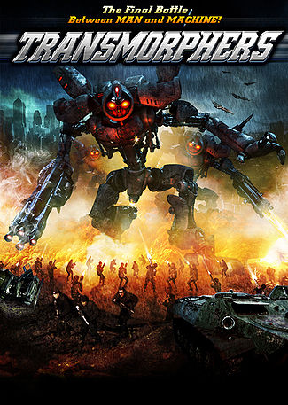
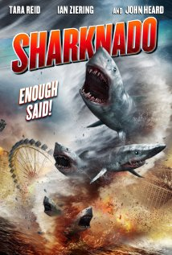

# 'The Asylum', een filmstudio met mockbusters
‘The Asylum’ is een Amerikaanse studio die films uitbrengt met een heel laag budget. De films worden ook slechts gemaakt op een paar maanden tijd… En de inspiratie halen ze gewoon uit de bioscoop.

De films van ‘The Asylum’ worden ook wel ‘mockbusters’ genoemd. Ze zijn telkens gebaseerd op een bestaande film, maar met een eigen twist. De schrijvers hameren erop dat het echt wel om originele verhalen gaat – het is dus geen plagiaat, misschien wel een vorm van parodie.

De studio ontkent niet dat ze hun inspiratie bij bekende films halen: dat is net de bedoeling. Hun films worden steeds uitgebracht rond dezelfde tijd dat het origineel uitkomt, vaak een grote blockbuster, een kaskraker dus. Die komen dan in de bioscopen, de mockbusters worden direct verkocht op video of dvd. Zo moet de studio zelf geen reclame maken: het publiek herkent de setting al van de bekende film.

Verschillende studio’s hebben ‘The Asylum’ al aangeklaagd, maar er is nooit een veroordeling van gekomen. Wel is de uitgave van één film een tijdje tegengehouden, zodat de twee gelijkaardige films niet op hetzelfde moment verschenen.

Voor wie benieuwd is, enkele films die ‘The Asylum’ uitgebracht heeft: ‘666: The Child’ (The Omen), ‘Snakes on a Train’ (Snakes on a Plane), ‘Transmorphers’ (Transformers), ‘Android Cop’ (RoboCop) – en Sharknado!