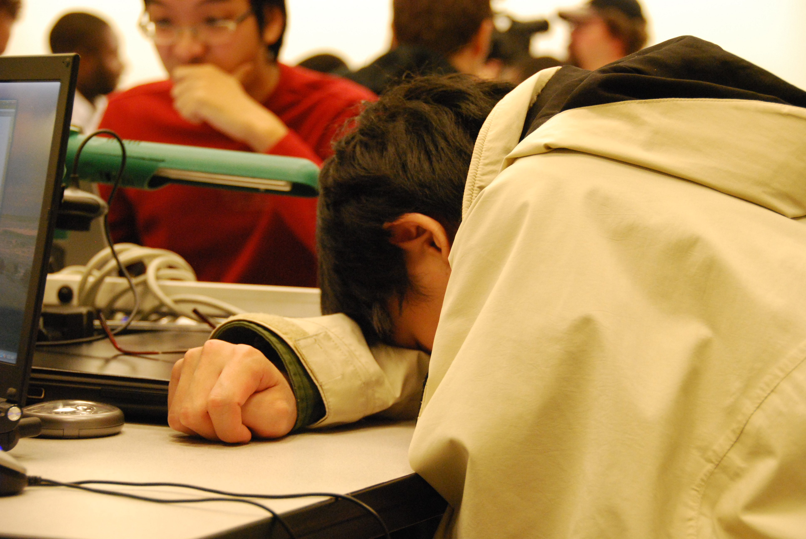

# 22u: verboden nog te studeren
In Zuid-Korea is het bij wet verboden om na 22u nog te studeren. Bizar, maar de overheid vindt het toch nodig streng op te treden. Het gaat zelfs zo ver dat politiepatrouilles dagelijks controles uitvoeren. En oh wee als ze je zien met je neus in de boeken…

Het is een stereotype waar in westerse landen vaak mee wordt gelachen: Aziaten zijn slim en moeten ook keihard studeren om hun ouders niet teleur te stellen. Helaas leunt dit stereotype heel erg aan bij de waarheid. In veel Aziatische landen gaan kinderen gebukt onder zware schoolstress, Zuid-Korea op kop.

Kinderen worden er van jongs af aan gepushed om de beste te zijn. Ouders geven dan ook massaal geld uit aan privéleraren – het is een uitzondering wanneer een kind géén privéles volgt na de schooluren. En dat alles om uiteindelijk aan de beste universiteit te gaan studeren. Jongeren die niet worden geaccepteerd op een van de drie grootste universiteiten, weigeren vaak om naar een andere school te gaan. Ze opteren liever voor nog een extra jaar fulltime privéles – om daarna opnieuw te proberen bij de beste scholen.

De Zuid-Koreaanse overheid heeft gelukkig al wel ingezien dat het anders moet, maar tradities zijn moeilijk te breken. Onder andere door deze wet proberen ze de kinderen wat vrijheid terug te geven. Kinderen mogen op zich thuis nog wel studeren, maar voor de vele privéleraren is het verboden om na 22u nog les te geven. Er staan ook effectief boetes op en de bevolking wordt beloond wanneer ze overtreders aangeven.

Ook in de scholen zelf wil de overheid van kinderen terug kinderen maken. Ze hebben de laatste jaren meer speeltijd gekregen en creatievere vakken zijn belangrijker geworden. Zo wordt de Zuid-Koreaanse jeugd aangemoedigd om ook sport en kunst te ontdekken – studeren is niet alles in het leven.