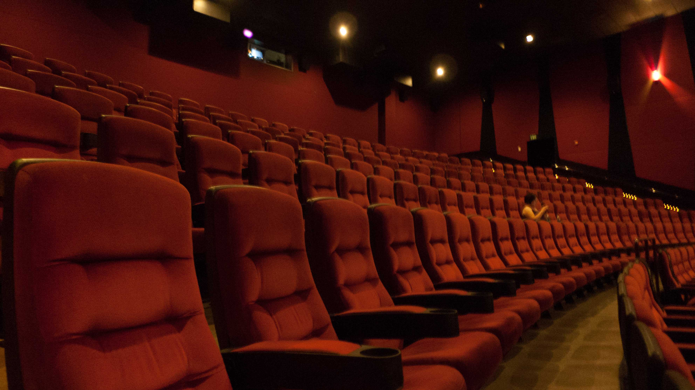

# Vind de beste plaats in de bioscoop
Een avondje cinema met vrienden - gezellig! Maar elke keer weer is er discussie over de zitplaats. De ene wil niet te ver naar voor, de ander niet te ver naar achter. Dicht bij de uitgang? Of net in het midden? Wat is nu echt de beste plaats om van je film te genieten?

Vroeger was het verstandig om vroeg naar de bioscoop te vertrekken. Wie laatst kwam, zat vooraan... En daar kreeg je nogal eens nekpijn van. De laatste jaren zijn daarin al grote vooruitgangen geboekt: ten eerste kan je nu vaak je zitje al op voorhand reserveren. Maar ook de zaal zelf is er sterk op vooruit gegaan: het scherm kan je nu perfect vanop elke stoel zien, zonder last van nekpijn - en zonder al te veel last van de mensen voor je. De laatste jaren zijn de schermen namelijk lager geplaatst en een beetje gebogen. Zo zie je ze beter wanneer je vooraan zit, maar ook helemaal vanaf de zijkant.

Toch is er nog steeds ruimte voor discussie over dat ene perfecte zitje. En dat heeft alles te maken met het geluid! Het beeld is dan wel voor iedereen goed, maar de boxen in een bioscoopzaal zijn ook heel belangrijk. Het beste geluid heb je wanneer je ongeveer in 2/3e van de zaal zit - dus 2/3e van de zaal voor je, 1/3e achter je - en dan in het midden van de rij.

De reden is eigenlijk simpel: wanneer de audio van de film gemixed wordt, zit de geluidstechnicus op dat punt in de zaal. Hij zorgt daar dus voor het ideale geluid. De beste plaats om de dialogen, muziek en luide explosies te horen!