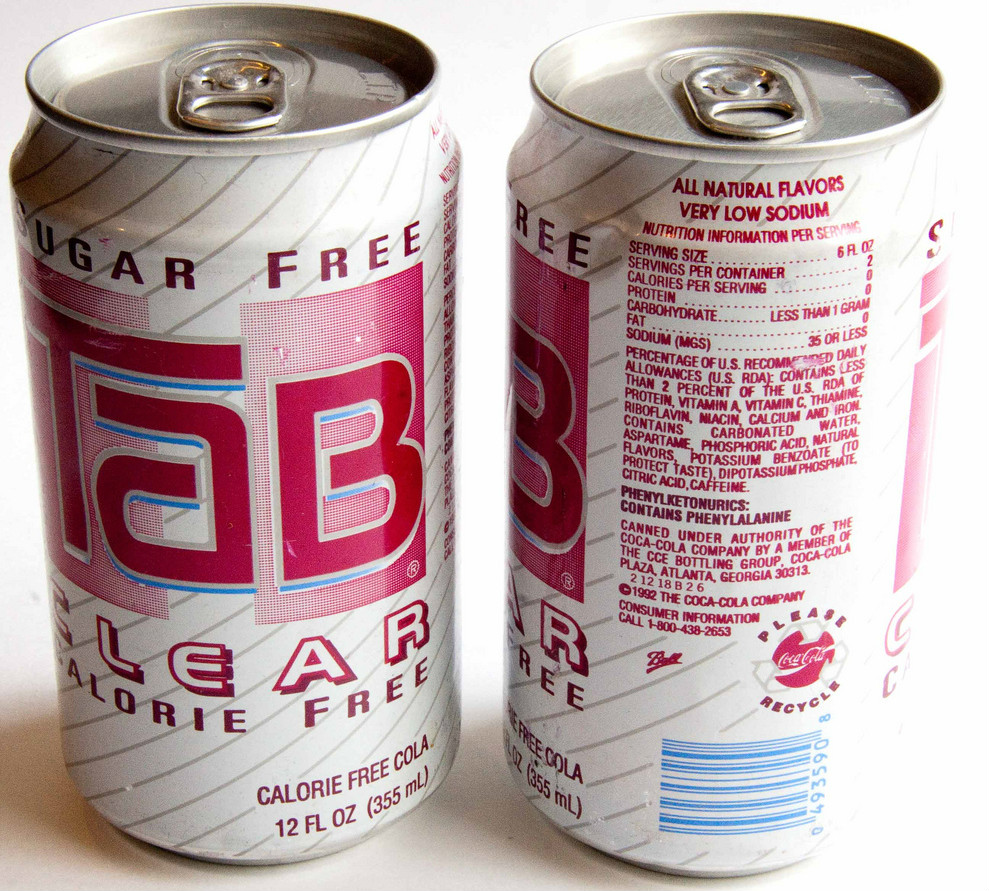

# Coca-Cola deed Pepsi floppen met slechte reclame
Begin jaren '90 kwam Pepsi met het briljante plan om **doorzichtige cola** te maken. Het product was meteen redelijk populair, totdat de concurrentie zich ermee ging bemoeien. Coca-Cola maakte een gelijkaardig product **en maakte expres slechte reclame**, zodat de klant ook geen Pepsi meer zou kopen.

Zo'n 25 jaar geleden waren allerlei doorzichtige drankjes plots populair. Mensen linkten ze aan **gezondheid**, bewust of onbewust. Daar speelde Pepsi gretig op in met **'Crystal Pepsi'.**

The Coca-Cola Company zette de tegenaanval in met **Tab Clear**, maar al snel flopten beide dranken. Volgens de reclame was Tab Clear **heel gezond, suikervrij en dus ideaal voor vrouwen die op dieet waren, bijvoorbeeld.**

Jaren later verklaarde **Sergio Zyman, marketing-baas bij The Coca-Cola Company**, dat ze het drankje expres als extreem gezond aanprezen. Volgens hem zouden klanten **Tab Clear verwarren met Crystal Pepsi** en denken dat dat dus ook gezond zou zijn. Die klanten zouden dus enorm teleurgesteld zijn door het toch-niet-zo-gezonde Crystal Pepsi.

Beide producten zijn dus na een paar jaar van de markt gehaald. Punten voor Coca-Cola dus, hoewel niet iedereen het sabotageverhaal gelooft. Misschien wou Coca-Cola gewoon profiteren van het succes van Pepsi en mislukte het hele plan? Wanneer we naar onderstaand filmpje kijken, denken we toch dat die reclame _echt_ expres slecht was.

<iframe width="100%" src="https://www.youtube.com/embed/0vz2nxdM0qc" frameborder="0" allowfullscreen></iframe>