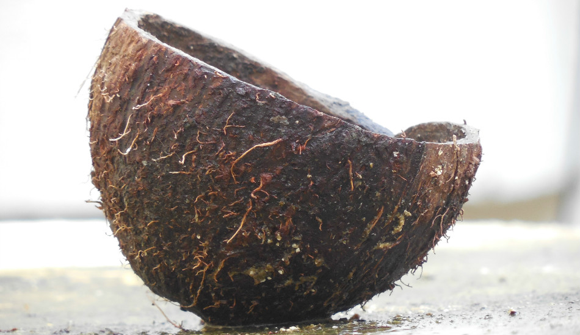

# Linkshandig zijn is dodelijker dan een haai
Haaien zijn een grote angst voor veel mensen: ze zijn dan ook vaak de grootste moordenaar in films. Er zijn echter veel dingen die dodelijker zijn dan een haai… Veel dingen waarvan je het niet zou verwachten. Linkshandig zijn bijvoorbeeld, of een kokosnoot.

Ongeveer 40 mensen per jaar sterven door een aanval van een haai. Geen groot aantal wanneer het over de hele wereldbevolking gaat. De kans dat het je overkomt, is 1 op 300 000 000... Dat is even veel als de kans dat je omkomt in een pretparkongeval. Rollercoasters zijn dus exact even dodelijk als haaien!

Een kokosnoot is bijvoorbeeld al veel gevaarlijker: jaarlijks overlijden 150 mensen doordat er een kokosnoot op hun hoofd valt. Ze kunnen namelijk een snelheid halen van 80 k/h wanneer ze van een boom vallen. De kans dat je daar dan net onder staat en niet meer rechtkomt, is 1 op 250 000 000. Auw!

Linkshandig zijn blijkt ook enorm gevaarlijk – ongeveer 2500 linkshandigen sterven jaarlijks doordat ze een product voor rechtshandigen verkeerd gebruiken. Het meest dodelijke wapen is een kettingzaag… Toch best investeren in gespecialiseerde apparatuur dus!