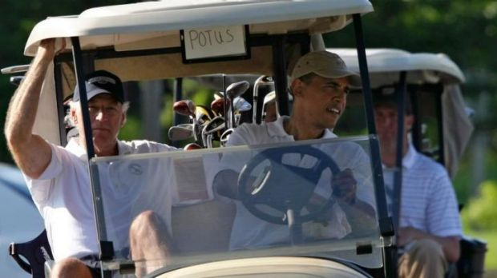

# De president van de USA mag niet rijden
Hillary Clinton en Donald Trump kunnen misschien maar beter twee keer nadenken de komende weken. Zijn ze wel bereid hun autosleutels voorgoed aan de kant te leggen? Want als ze ooit **president van de Verenigde Staten van Amerika** worden, mogen ze **nooit meer met de auto rijden.**

De **Secret Service**, de agenten die belangrijke politici beschermen, vinden het **te gevaarlijk** om hen zelf achter het stuur te laten kruipen. Dat geldt dus voor een heel aantal policiti. Zo liet Hillary Clinton in 2014 weten dat ze dankzij haar politieke carrière al achttien jaar niet meer zelf gereden had, tot haar grote spijt. Als ze president zou worden, wordt dat alleen maar erger: **alle oud-presidenten** hebben voor de rest van hun leven een agent als chauffeur.

Dat ligt dus niet aan hun eigen luiheid of aan het feit dat ze verwend zouden zijn. Integendeel: veel oud-presidenten hebben zo hun eigen manier om **de regels te omzeilen.** Vaak kruipen ze toch nog achter het stuur **op hun eigen privéterrein.** President Obama wordt bijvoorbeeld al eens gespot achter het stuur van een golfkarretje. Zolang ze zich **niet op de openbare weg** begeven, vinden de agenten dat nog prima.