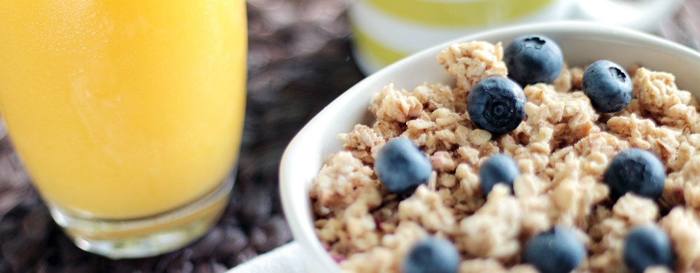

# Reclametrucs: eten fotograferen
Dat reclame nooit helemaal echt is, weet iedereen. Maar hoe ver gaan ze daarin? Is de melk in een cornflakesreclame wel echt melk? En hoe kunnen ijsjes zo’n lange fotoshoot overleven zonder te smelten? _Spoiler alert_: het is geen melk, en het is ook geen ijs.

Om het simpele voorbeeld van ijsjes te nemen: in die reclame zie je bijna nooit echte ijsjes. Meestal worden kleurstoffen toegevoegd aan aardappelpuree en worden daarmee bolletjes geschept – het verschil is niet te zien, maar de puree zal niet smelten.

Hetzelfde geldt voor een kom cornflakes met melk. De cornflakes lijken in reclame soms op de melk te zweven… Het is dan ook geen echte melk – zelfs geen echte kom. De kom is niet hol, maar heeft een plat oppervlak. Daarbovenop wordt een dikke laag lijm gesmeerd, en daarop worden de cornflakes mooi gerangschikt, precies zoals de fotograaf dat wil.

En wat dacht je van een lekker stukje vlees op de BBQ? Het vlees dat je in de reclame ziet, is bijna nooit echt gebakken of gebraden. Het wordt wel behandeld met allerlei producten om het zo te doen lijken… Zoals schoensmeer. Smakelijk!