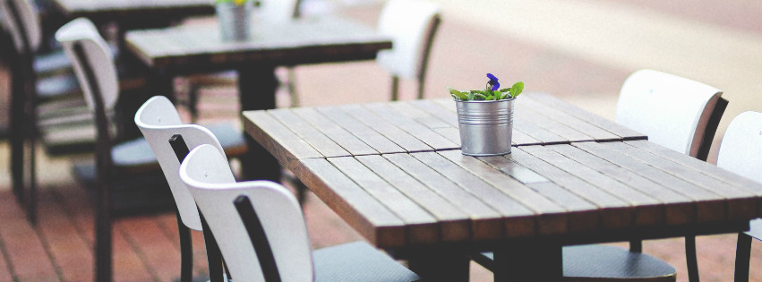

# Je eigen restaurant voor één dag
Je eigen restaurant of café openen – voor velen een droom, maar het is vooral veel werk en verantwoordelijkheid. Behalve op Restaurant Day! Het initiatief komt uit Finland, maar de laatste jaren is er ook in onze buurlanden aandacht voor.

Het doel is simpel: iedereen mag voor één dag zijn of haar eigen restaurant uitbaten. ‘Mijn pop-up restaurant’, dus. Er is maar één voorwaarde: geen alcohol.

Deelnemers moeten zich geen zorgen maken over vergunningen, dus je kan gewoon voor een dagje zien hoe het is om chef te zijn. En ondertussen gebeurt dat al in meer dan 40 landen.

Voor wie ook geïnteresseerd is: de volgende Restaurant Day is morgen, 17 augustus. In België lijken er geen tijdelijke restaurantjes te komen, maar in Nederland en Duitsland vind je er wel. De volledige lijst zie je op <a href="www.restaurantday.org/en/find/">de officiële website.</a>