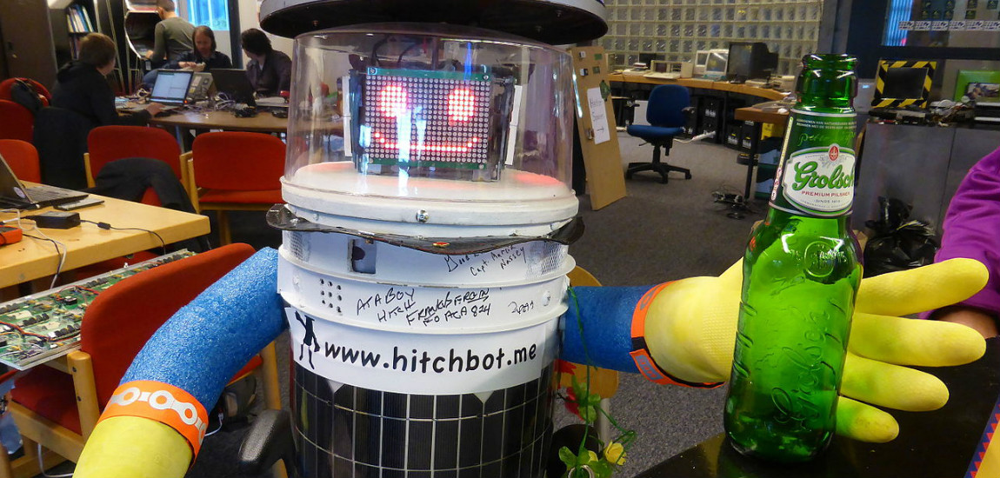

# De hitchBOT lift door Canada
Een hele zomer rondtrekken – te voet, met de auto, of al liftend. Het is een droom voor velen, maar deze zomer heeft een heel speciaal individu het gedaan: hitchBOT. De robot maakte een reis doorheen Canada… liftend.

hitchBOT is ontwikkeld in de universiteit van Toronto, in Canada. Het doel was om de robot een reis te laten maken van Halifax, in het oosten van het land, naar Victoria, in het westen. En dat alleen dankzij de goede wil van voorbijgangers. hitchBOT werd ergens opgepikt, mocht een tijdje meerijden, en werd dan weer ergens afgezet – om daar weer een nieuwe chauffeur te zoeken.

Dat de reis vlot verliep, konden fans zien op de Facebookpagina van hitchBOT. Uiteraard hielpen zijn ‘ouders’ een handje in zijn reis. Chauffeurs kregen het concept uitgelegd via de robot en werden aangemoedigd ook foto’s te maken. Dat levert een mooie collage op van een robot die het land doorkruist.

Afgelopen week is hitchBOT aangekomen op zijn eindbestemming – project geslaagd dus! De robot kan misschien wel een bron van inspiratie zijn voor avonturiers die zelf een grote reis willen maken...