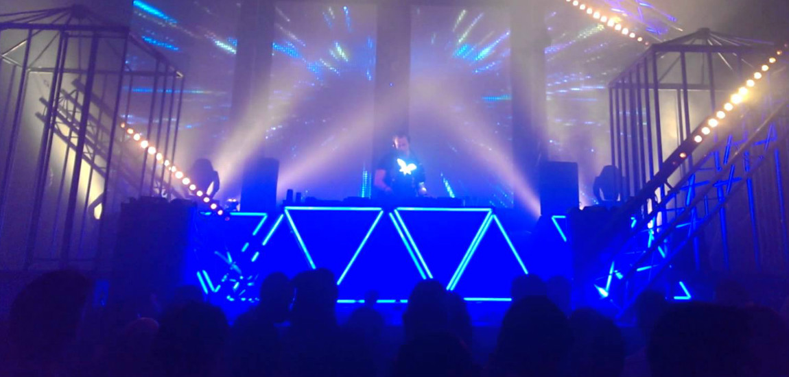

# In Zweden krijg je boetes als je danst
In de horeca zijn een hoop vergunningen nodig: om eten te serveren, om alcohol te schenken… En in Zweden heb je een vergunning nodig om te dansen. Wanneer een uitbater geen vergunning heeft, kunnen de zaak én de dansers een boete krijgen.

Zweden heeft een lange geschiedenis met wetten rond muziek. Zo is het lang verboden geweest om elektronische muziek te spelen in het openbaar. Maar ook deze danswet dateert al van in de jaren ’30 – en de wet bestaat nog steeds.

Alle cafés of discotheken waar gedanst wordt, moeten daarvoor een vergunning hebben. Ook wie een feest wil geven op een openbare locatie, moet er een aanvragen. De regering ging er in de jaren ‘30 namelijk van uit dat dansen de openbare orde zou kunnen verstoren. Heel vreemd tegenwoordig, maar er worden nog steeds boetes voor uitgeschreven.

De afgelopen jaren zijn er al enkele protesten geweest tegen deze wet. Protestanten kwamen samen om te dansen door de straten van Stockholm. Voor de regering is de wet echter geen prioriteit – enkele politici geven wel aan dat ze er iets aan willen doen, maar wij wachten nog steeds op de dag dat iedereen weer vrij kan dansen.