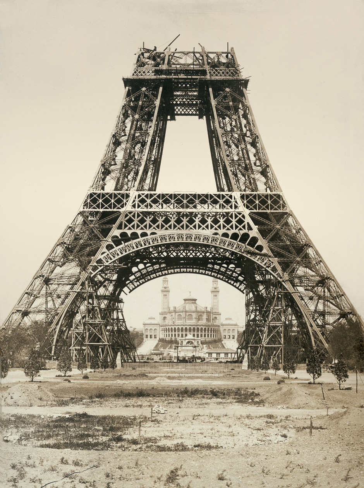

# Te koop: Eiffeltoren
Een bordje ‘te koop’ bij de Eiffeltoren. Zou jij het geloven? De toren in Parijs is al twee keer verkocht geweest… Door een oplichter, welteverstaan.

Victor Lustig wordt wel eens ‘the smoothest con man ever’ genoemd, of de gladste oplichter ooit. In de jaren ’20 en ’30 verkocht hij onder andere machines die zogezegd perfect nagemaakt geld zouden drukken. Hij stopte dan zelf wat briefjes van honderd dollar in de machine, klanten kochten die voor tienduizenden dollars en ze konden inderdaad een aantal briefjes 'printen'... Tot de machine leeg was natuurlijk - en Lustig met de noorderzon verdwenen.

De grootste frats die de oplichter heeft uitgehaald, zal toch het verkopen van de Eiffeltoren zijn. Die is gebouwd in 1889 en het oorspronkelijke plan was dat de toren maar een paar jaar zou blijven staan. In de jaren ’20 was er dus heel wat speculatie over wat er met de toren zou gaan gebeuren. Daar maakte Lustig gretig gebruik van.

Hij deed zich voor als ambtenaar en bezocht zo enkele schroothandelaren in en rond Parijs. De toren zou afgebroken worden en wie het hoogste bod deed, mocht al het ijzer hebben. Lustig gaf de mannen een rondleiding op de toren om zijn plan realistisch te doen lijken en één van de schroothandelaren hapte. Hij gaf Lustig alvast een voorschot en wat omkoopgeld om zijn bod te laten winnen – de oplichter ging ervandoor met €70 000.

Omdat de schroothandelaar zo beschaamd was door zijn eigen poging tot omkoping, durfde hij niet naar de politie te stappen… Met als gevolg dat Lustig de toren nóg eens verkocht. Vlak voor deze deal werd afgesloten, is hij echter gevlucht uit angst om opgepakt te worden.

Uiteindelijk wist de FBI hem bij de kraag te vatten en op te sluiten in New York, in 1935. Dat duurde echter niet lang, want de gladde oplichter wist uit zijn cel te ontsnappen. Een maand later werd hij weer opgepakt en opgesloten in Alcatraz, waar hij tien jaar later zou overlijden.