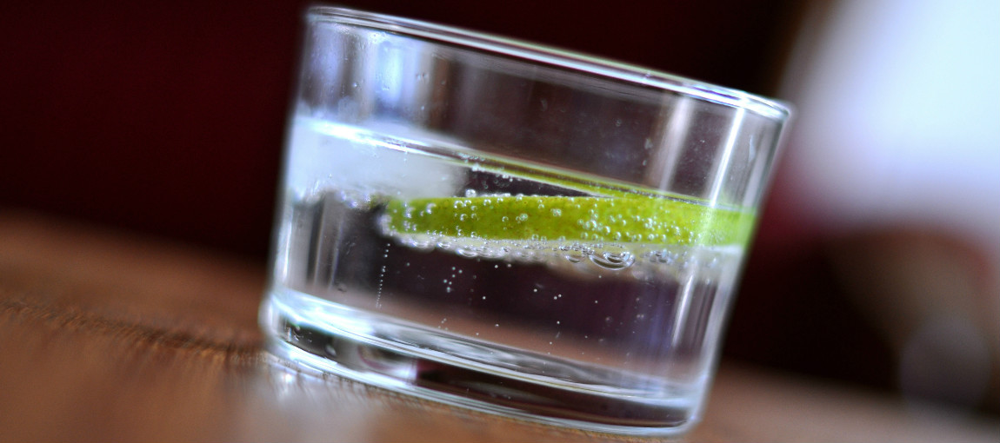

# Gin-tonic bestaat dankzij malaria
Ga je misschien een gin-tonic drinken dit weekend? Dat heb je dan allemaal te danken aan **malaria!** De geweldig populaire cocktail is **uitgevonden om de ziekte te voorkomen en te behandelen.** Dankjewel, geneeskunde!

Het begon allemaal **in India, in de 18e eeuw.** Het Verenigd Koninkrijk had daar de Britse Oost-Indische Compagnie opgestart, om **handel** te voeren vanuit India. Na verloop van tijd werd die commerciële onderneming **steeds machtiger**, waardoor er zich ook een groot Brits leger vestigde... Maar de soldaten werden geveld door malaria.

Gelukkig vond de legertop een oplossing: bepaalde medicijnen die de stof **kinine** bevatten, leken ook tegen malaria te werken. Kinine zorgde bij die medicatie ook voor een enorm **bittere smaak.** Omdat de soldaten het zo vaak moesten drinken, probeerden ze het dus **wat lekkerder te maken** - en ze hadden een grote voorraad gin in India...

Kinine zorgt vandaag de dag **nog steeds voor de bittere smaak in tonic**, maar met een veel kleinere dosis dan in die vroegere medicijnen. Een gin-tonic op een terras zal je in elk geval **niet meer beschermen tegen malaria**, maar oorspronkelijk was die cocktail dus wel een belangrijk medicijn!