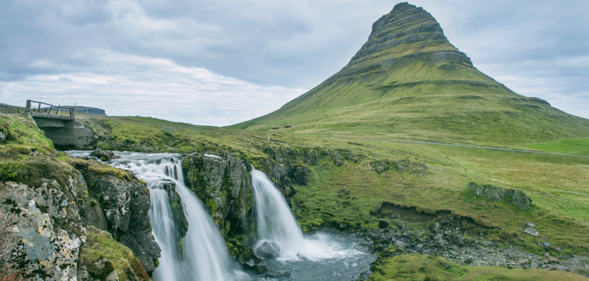

# 'Groenland' lijkt wel een verkeerde naam...
Groenland is een grote blok ijs, IJsland heeft prachtige groene natuur. De namen lijken wel omgewisseld te zijn. Volgens enkele historici zou dat exact kunnen zijn wat er gebeurd is – waarschijnlijk zelfs met opzet.

De eerste ontdekkingsreizigers die op Groenland kwamen, besloten daar te blijven. Het was echter geen aanlokkelijk land, dus het zou moeilijk worden om anderen erheen te trekken. Daarom hebben ze voor de naam Groenland gekozen. Hun landgenoten kregen het idee dat het een prachtig land moest zijn, en een aantal families migreerden ook.

Dat is echter maar één versie van het verhaal. Volgens een oude saga hebben de Vikingen de namen Groenland en IJsland bedacht. En ook zij hadden het plan om anderen te misleiden… Maar dan wel hun vijanden.

De Vikings dachten namelijk dat iemand wel zou proberen één van hun landen te veroveren. En als je dan kan kiezen tussen Groenland en IJsland, is de keuze niet moeilijk. Vijanden zouden dus eerder naar Groenland trekken en verrast zijn om daar een dikke laag ijs aan te treffen.

Historici zijn er nog steeds niet uit waar de namen precies vandaan komen. Deze twee saga’s doen al eeuwen de ronde, maar het is dus niet duidelijk of we er wel één moeten geloven.