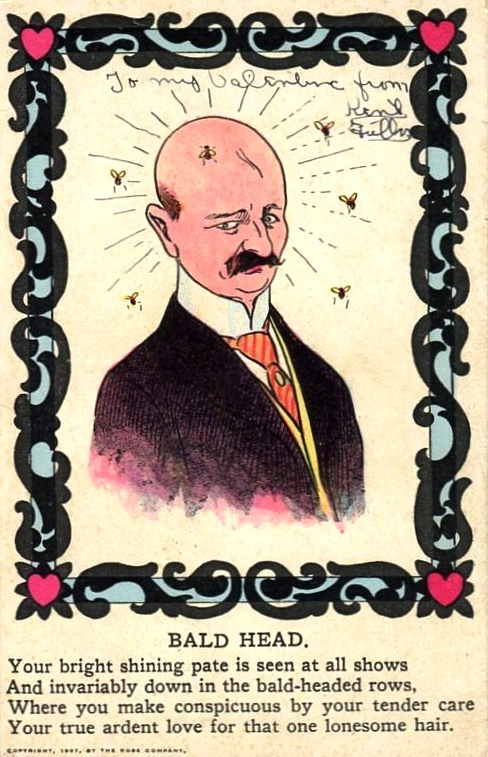
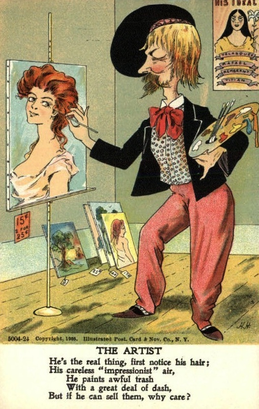
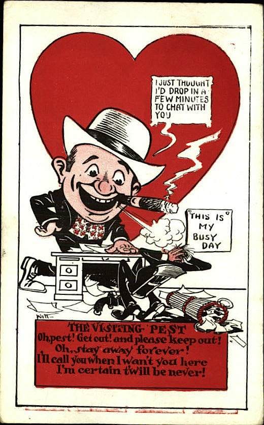
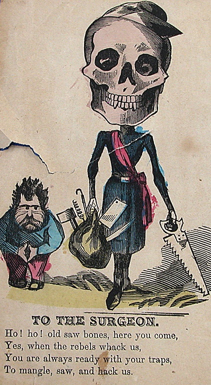

# Vroeger kreeg je haatberichtjes op valentijn
Ook romantische berichtjes ontvangen vandaag? Prijs jezelf gelukkig, want tussen 1840 en 1940 was het net andersom. Toen kreeg je regelmatig haatberichtjes op 14 februari.

Valentijn bestond al wel zoals we het vandaag kennen, maar daarbovenop was er de 'Vinegar Valentine' - 'azijnvalentijn'. Je vertelde je lief dat je hem of haar graag zag en andere mensen kon je anoniem vertellen dat ze net niét zo tof waren.

Sommige anti-valentijnskaartjes waren heel luchtig, zelfs grappig. Ze waren een manier om je hart te luchten. Een collega of vriend met een vervelende eigenschap, kon je een anoniem kaartje sturen met een grappig gedicht. Andere boodschappen zijn dan weer zwaarder - gedumpt worden met een kaart op valentijn is natuurlijk helemaal niet leuk.

