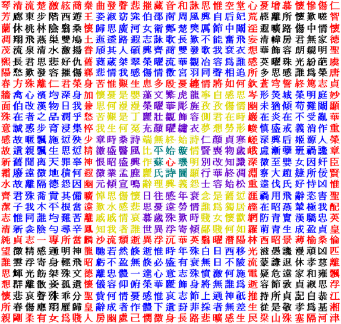

# 7940 gedichten in één
De Chinese Su Hui zou de schrijfster zijn van de meest complexe palindroom tot nog toe. Haar beroemde gedicht, dat je hieronder ziet, kan op maar liefst 7940 verschillende manieren gelezen worden!

Een palindroom is een woord of zin die symmetrisch is – je kan hem dus van voor naar achter lezen, maar ook van achter naar voor. Enkele voorbeelden zijn ‘kok’, ‘lepel’ en ‘de pot op, Ed!’ Maar er bestaan ook veel grotere palindromen, zoals het gedicht van Su Hui.

Dit Chinese gedicht doet al eeuwen de ronde, maar het zou geschreven zijn in de periode van de Zes Dynastieën, tussen het jaar 220 en 589. Dit is waarschijnlijk de meest uitgebreide palindroom die tot nog toe bestaat: het gedicht zou gemaakt zijn om als een spiraal te lezen, maar het kan ook horizontaal, verticaal en diagonaal. Binnenin zitten nog verhalen verstopt, die in een moderne versie in kleuren aangeduid zijn.

Volgens de legende zou Su Hui het gedicht geschreven hebben voor haar man, die verbannen was naar de woestijn. Ze zou het op deze manier gecodeerd hebben, zodat alleen hij het kon ontcijferen. De vraag is natuurlijk of hij de volledige code heeft kunnen kraken.