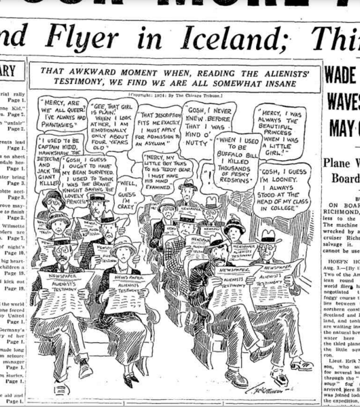

# That awkward moment when you see a meme from 1924
De meme 'that awkward moment when' bestaat dus al _zo_ lang!

In de Chicago Daily Tribune van maandag 4 augustus 1924 komt het voor het eerst voor in een cartoon. We zien een groep mensen die een krant lezen - meer bepaald het verslag van een psycholoog over een of andere crimineel. Iedereen die de krant leest, denkt van zichzelf dat ze ook weleens zo gek zouden kunnen zijn als die crimineel... Awkward!

