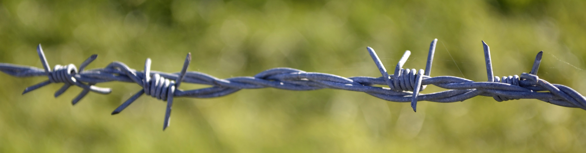

# Was prikkeldraad het eerste sociale netwerk?
Aan het eind van de 19e eeuw maakte de telefoon zijn opmars. In afgelegen hoeken van Amerika was het **moeilijk een telefoon aan te sluiten.** Daar gebruikten ze dan maar prikkeldraad.

In de jaren 1890 werden Amerikaanse steden voorzien van **telefoonlijnen.** Buiten de steden was dat te omslachtig omdat de huizen vaak **kilometers uit elkaar** stonden. Bewoners vonden echter zelf een oplossing. Er was namelijk al iets dat **elk erf met elkaar verbond: hekken met prikkeldraad.**

Zo werd in de Far West het **eerste sociale netwerk** opgericht. Elk huis verbond een telefoon met de prikkeldraad. Omdat er geen schakelbord aan te pas kwam, **rinkelde élke telefoon wanneer je wou bellen.** En dus moesten er goede afspraken gemaakt worden. Elk huis had bijvoorbeeld een eigen ‘ringtone’: wou je de familie Smith bellen, dan rinkelde je twee keer kort. En het was **onbeleefd om gesprekken af te luisteren.**

Het feit dat iedereen met elkaar verbonden was, leverde ook voordelen op. Er konden bijvoorbeeld **massaal boodschappen doorgegeven worden.** En de telefoon zorgde ook voor ontspanning: vaak speelde iemand ‘s avonds muziek, en alle buren konden meeluisteren. Echt zoals we nu sociale media gebruiken, dus. 