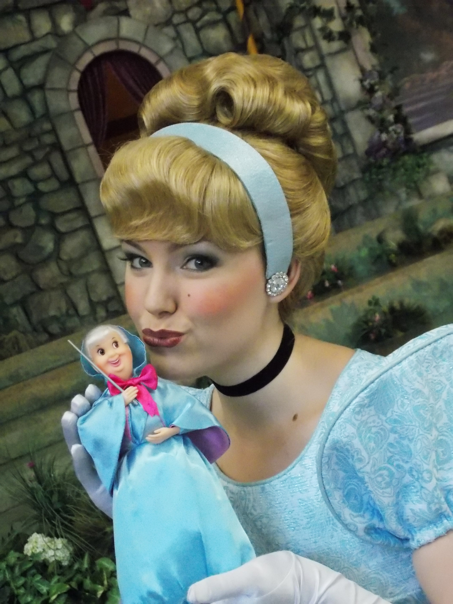

# De tandenfee, een uitvinding van Disney
Wij kennen het vooral van Hollywood: wanneer een kind zijn of haar babytandjes verliest, worden ze onder een kussen gelegd en laat de tandenfee een centje achter. In veel culturen bestaat er een bepaalde traditie rond babytandjes, maar de tooth fairy is een typisch Amerikaans fenomeen. En daar zou Disney voor iets tussenzitten.

De originele ‘tandenfee’ was geen fee, maar een muis. In veel oudere culturen werden babytandjes namelijk geofferd aan muizen nadat ze uitgevallen waren. Ouders hoopten daarbij dat de nieuwe tanden van hun kinderen even sterk zouden worden als die van een muis.

In de jaren ’40 en ’50 bracht Disney films uit zoals Pinocchio en Assepoester, waarin een goede fee steeds een belangrijke rol speelt. In Europese folklore bestonden feeën en elfjes al langer, maar in Amerika hadden ze er minder voeling mee. En dus moest Disney ervoor zorgen dat alle Amerikaanse kinderen in feeën zouden geloven.

Zo is het idee van de tandenfee, of de tooth fairy, geboren. Uitgevallen tandjes worden voor het slapengaan onder een kussen gelegd, en de tandenfee komt ze dan wisselen voor wat geld. Zo gaan jonge kinderen dromen van die goede fee die hen zal komen bezoeken, net zoals in de sprookjes.