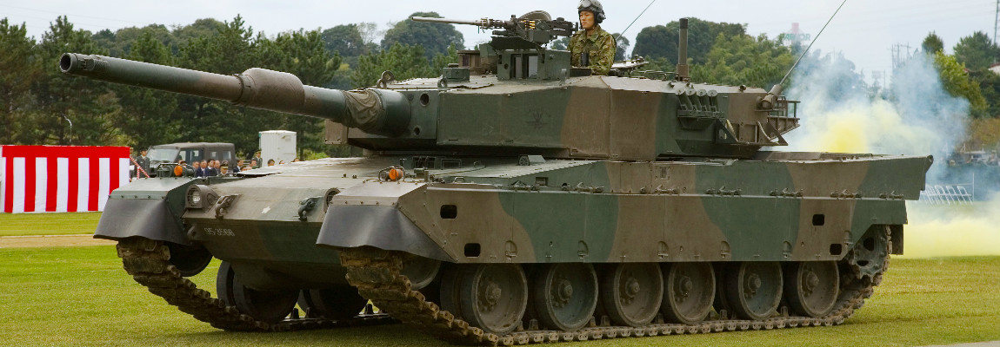
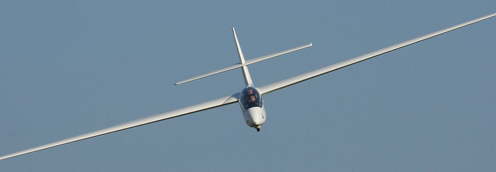

# Er was eens een tank die kon vliegen
Dat oorlogen vaak een periode zijn van grote technologische vooruitgang is geweten. Denk bijvoorbeeld aan de Eerste Wereldoorlog die ons de condensor-microfoon schonk, vliegtuigen verbeterde maar ook zorgde voor het gasmasker zoals we dat vandaag kennen.

Ook in de Tweede Wereldoorlog werd er geëxperimenteerd en vooruitgang geboekt. Zo betekenden de V1- en V2-raketten van de Duitsers de doorbraak van de straalmotor en ontwierpen de Amerikanen de atoombom. Ook de radar, de sonar en de computer werden tijdens die oorlogsjaren op punt gesteld.

Er waren echter ook minder succesvolle initiatieven, zoals de Russische Antonov A-40-tank. Niets speciaals denk je dan, maar wat als je weet dat het niet louter een tank was maar ook een vliegtuig? Althans, een _glider_.

_Gliders_ zijn niet-gemotoriseerde vliegtuigen die wij beter kennen als zweefvliegtuigen. Ze speelden een belangrijke rol bij de Duitse aanval op het Belgische fort Eben-Emael maar ook op D-day en tijdens Operation Market Garden, de bevrijding van Nederland, toonden ze hun nut. Gezien ze geen motor hebben, zijn ze immers een pak stiller dan gewone vliegtuigen waardoor je de vijand kan verrassen.

Tijdens dergelijke operaties werden ze meestal gebruikt om troepen af te leveren, maar soms ook materiaal. Gezien ze echter geen motor hadden en dus amper konden afremmen, was het steeds hopen op een landing met zo weinig mogelijk slachtoffers en materiële schade. Hou daarbij in het achterhoofd dat hun landingszones vaak niet ideaal waren en je kan je al voorstellen dat het regelmatig misliep. Ze werden dan ook eerder beschouwd als ‘wegwerpvliegtuigen’ en werden niet verondersteld terug te keren.

Het materiaal dat met _gliders_ werd vervoerd, varieerde van geweren en luchtafweergeschut tot jeeps. De Russen zagen het dus groter en wilden er ook (lichte) tanks mee vervoeren. Het idee voor de Antonov-A40 was geboren, maar zou geen lang leven beschoren zijn.

Het idee van geestesvader Oleg Antonov was als volgt: een lichte tank, bijvoorbeeld een T-60, werd uitgerust met een stel afwerpbare vleugels en bevestigd aan een groter vliegtuig, zoals een bommenwerper TB-3. Dat vliegtuig trok de tank de lucht in en ontkoppelde het tijdens de vlucht. De tank zweefde naar de grond, ontdeed zich van zijn vleugels en was klaar voor de strijd.

Probleem: er was geen vliegtuig sterk genoeg om de nodige snelheid te ontwikkelen om een tank mee in de lucht te trekken. Het idee stierf na een eenmalig experiment in 1942 een stille dood en zou dus nooit ‘van de grond komen’.