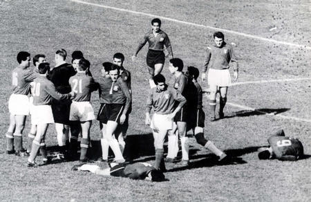

# De uitvinding van de rode en gele kaart
Tegenwoordig zijn ze niet meer weg te denken van het voetbalveld, maar de gele en rode kaarten werden pas **in 1966 uitgevonden door een scheidsrechter en zijn vrouw.**

De Brit Ken Aston was scheidsrechter tijdens één van de beruchtste wedstrijden ooit, de zogenaamde **Battle of Santiago.** In 1962 treffen **Chili en Italië** elkaar op het WK en de wedstrijd loopt niet zonder slag of stoot. Aston moet meermaals **een gevecht op het veld onderbreken.**

Daarbovenop was het heel moeilijk voor Aston om **zich verstaanbaar te maken.** Hij moest al zijn waarschuwingen en beslissingen mondeling communiceren, aan spelers die **vaak geen Engels begrepen.** En de trainers en het publiek wisten nooit wat er gaande was.

Tijdens het WK van 1966 is Aston getuige van opnieuw zo’n hectische match. **Engeland en Argentinië treffen elkaar in de kwartfinale** en de twee ploegen zijn op dat moment al rivalen. Scheidsrechter Rudolf Kreitlein kan zich weer **amper verstaanbaar maken.**

Wanneer Aston die avond naar huis rijdt en **langs een verkeerslicht passeert**, krijgt hij een geniaal idee. Met **universele kleurcodes** zijn beslissingen op een veld makkelijk te communiceren én zijn ze meteen duidelijk voor het hele stadion. Bij thuiskomst legt Aston het idee uit aan zijn vrouw Hilda. Die bedenkt meteen de volgende stap: ze maakt **een rode en gele kaart die in het zakje van zijn hemd passen.** En de rest is geschiedenis.