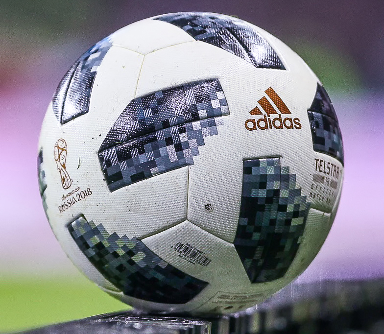

# Een voetbal is zwart-wit voor tv-kijkers
Adidas introduceerde in 1968 de Telstar voor het Europees Kampioenschap voetbal. Hoewel voetballen toen meestal bruin waren, was dit er een met witte en zwarte vlakken. Speciaal voor supporters die op **een zwart-wittelevisie** keken.

Als je iemand vraagt **een voetbal te tekenen**, is het resultaat voorspelbaar. Je telt ze waarschijnlijk niet, maar een bal met **12 zwarte vijfhoeken en 20 witte zeshoeken** wordt gezien als een standaard voetbal. Dat is dus pas zo sinds voetbal massaal gekeken werd op zwart-wittelevisie. De bruine voetballen, die tot dan toe gebruikt werden, waren **niet goed zichtbaar** voor de kijkers thuis.

De Telstar werd voor het eerst op een WK gebruikt in 1970. Op het **WK 2018** is de Telstar trouwens nog eens vanonder het stof gehaald. Adidas doopte deze nieuwe wedstrijdbal de **Telstar 18**. Het typische zwart-witte design kreeg een moderne toets, waarbij onder andere de hoeken van de zwarte vijfhoeken gepixeld werden.