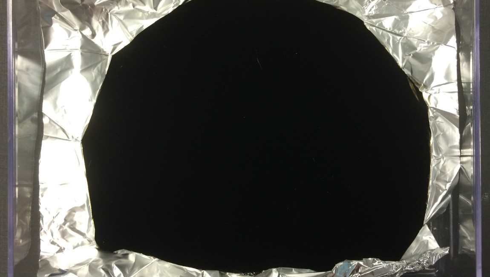

# De kleur zwart is van mij!
Anish Kapoor heeft de rechten voor het gebruik van het zwartste zwart in de kunstwereld. Twee jaar geleden vonden wetenschappers **Ventablack** uit, een extreem donkere kleur **die al het licht absorbeert.** Het meest zwarte zwart ooit uitgevonden, dus - en **de Brits-Indische kunstenaar Anish Kapoor heeft de exclusieve rechten gekregen.**

Onderzoeker Ben Jensen, die de leiding had over het team dat het materiaal uitvond, is grote fan van het werk van Kapoor. Geen probleem dus om de exclusieve rechten aan hem te geven. **Andere kunstenaars zijn er niet zo blij mee...** Velen geven aan dat zwart een enorm belangrijke kleur is in kunst, en dat het oneerlijk is dat slechts één persoon het donkerste zwart mag gebruiken. Helaas!

Mochten ze het toch proberen, dan **kan Kapoor hen aanklagen voor het gebruik van 'zijn kleur'.** Nog wel een pluspunt: zijn rechten gelden **enkel in de kunstwereld.** Je mag de ultieme donkere kleur dus nog wel vrij gebruiken, zolang het niet voor een kunstwerk is. Je slaapkamer pikzwart verven, mag dus nog!