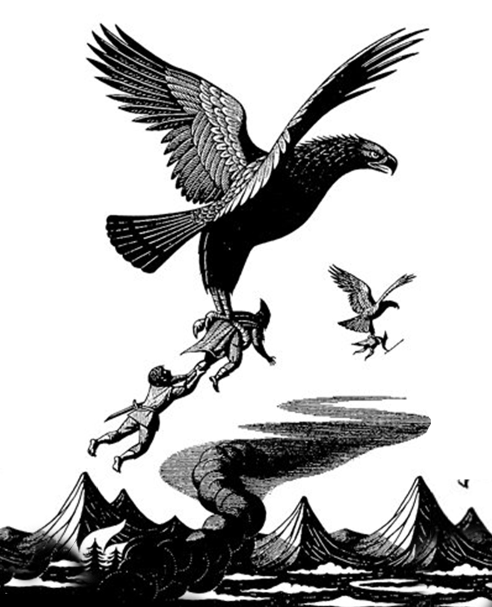
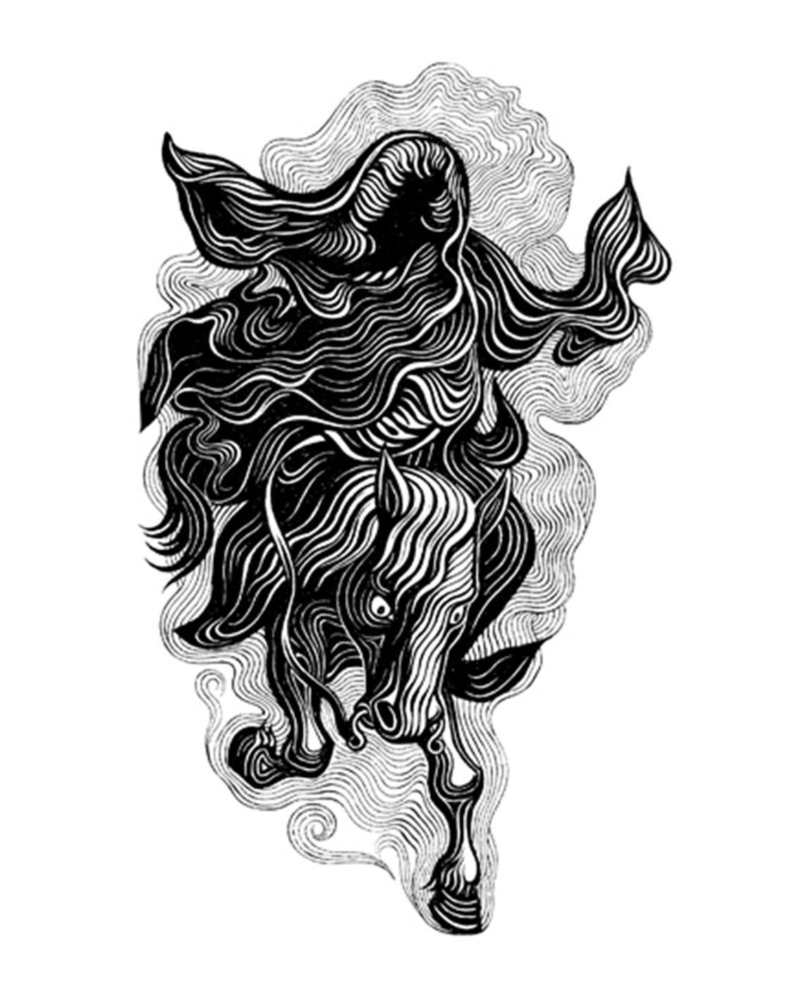

# Koningin en Tolkien-illustrator
J.R.R. Tolkien, auteur van The Hobbit en The Lord of the Rings Trilogy, was heel kritisch tegenover tekenaars die zijn werk wilden tekenen. Velen probeerden het, maar hij gaf maar weinigen de kans om effectief voor zijn boeken te illustreren. Eén van de gelukkigen was de koningin van Denemarken!

Koningin Margaretha II - momenteel nog steeds op de troon - stuurde Tolkien enkele van haar werken toen ze nog kroonprinses was. In '77, toen Margaretha II al vijf jaar koningin was, besloot Tolkien dat haar illustraties in een Deense uitgave van 'The Lord of the Rings' mochten verschijnen.

Kan je je inbeelden dat onze koning of koningin zou tekenen voor zo'n boek? Bekijk hieronder enkele illustraties van de hand van Margaretha II:

