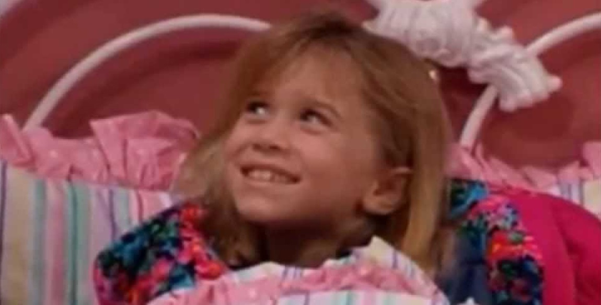

# De Olsen-zusjes droegen vroeger een vals gebit
Handig, twee kleine actrices die een tweeling zijn! In de serie Full House speelden Mary-Kate en Ashley Olsen de schattige Michelle. Eén personage gespeeld door twee kinderen, dus de kindsterretjes raakten niet overwerkt... Maar ze moesten wel een vals gebit dragen.

Mary-Kate en Ashley waren namelijk allebei wat babytandjes kwijt, maar natuurlijk niet dezelfde tanden. En dat mocht niet opvallen bij hun personage Michelle. Haar stralende glimlach was dus een vals gebit!