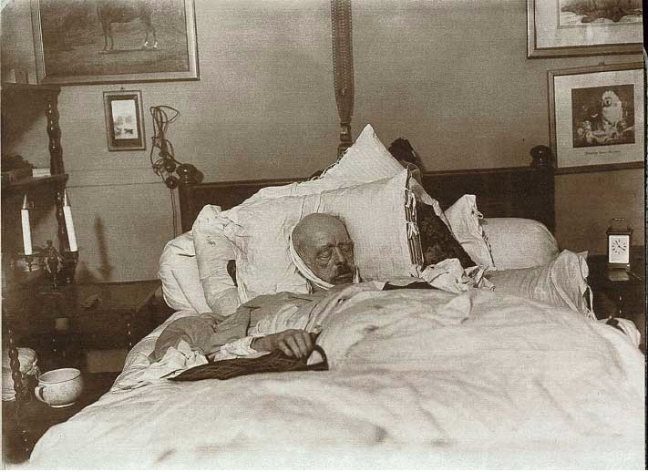

# De paparazzi van 1898
Tegenwoordig is het een bekend beeld in de straten van Hollywood. Foto’s van paparazzi sieren dagelijks tijdschriften en worden massaal verspreid op het internet. Dat soort fotografen gaat echter al langer mee dan je zou denken: de eerste paparazzifoto’s dateren van het jaar 1898.

Op 30 juli 1898 stierf Otto von Bismarck in zijn landhuis in Friedrichsruh, in Duitsland. Hij was graaf, daarna hertog en zelfs bondskanselier van de Noord-Duitse bond. Een zeer belangrijk figuur dus, en zijn dood kreeg dan ook veel aandacht – zo ook van de fotografen Max Priester en Willy Wilcke.

Zij hadden een bediende van von Bismarck omgekocht. Die was namelijk al een tijd ziek; de man moest de fotografen op de hoogte houden van zijn conditie. Op de avond van zijn dood werden de twee mannen dan ook meteen verwittigd. Nadat de familie afscheid had genomen, loodste de bediende hen binnen.

Zo zijn de eerste paparazzifoto’s geboren. Priester en Wilcke probeerden hun primeur te verkopen via een advertentie in de krant, maar dat had ook de familie van von Bismarck gezien. De politie werd erbij gehaald en de familie kreeg de foto’s in handen. De fotografen én de omgekochte bediende mochten een paar maanden in de cel doorbrengen. Uiteindelijk werd één van de foto's toch gepubliceerd, in 1952. Zo weten we nu dus wat de allereerste paparazzifoto was.