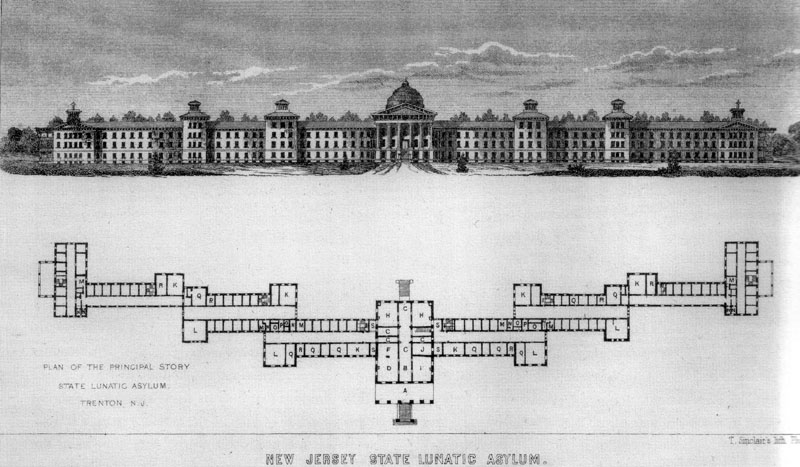
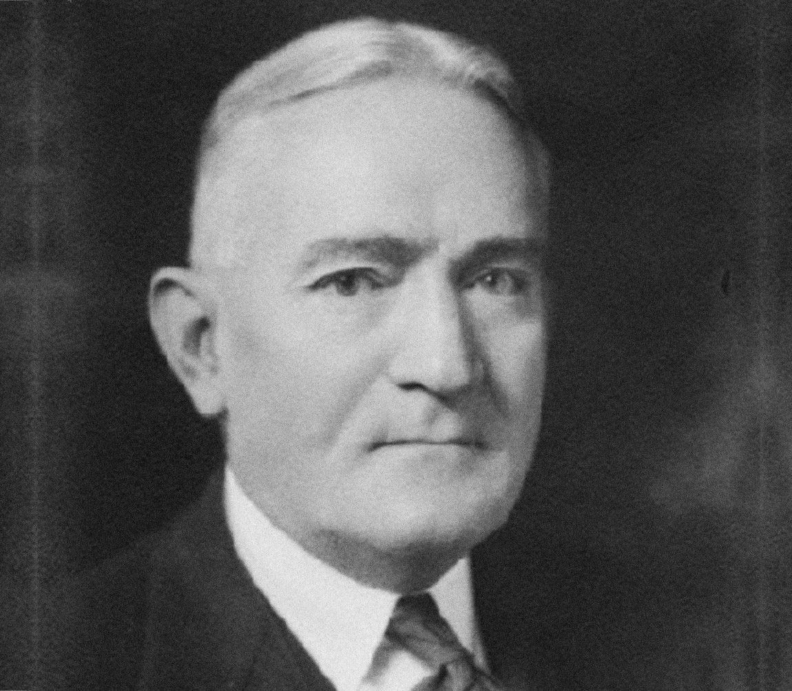
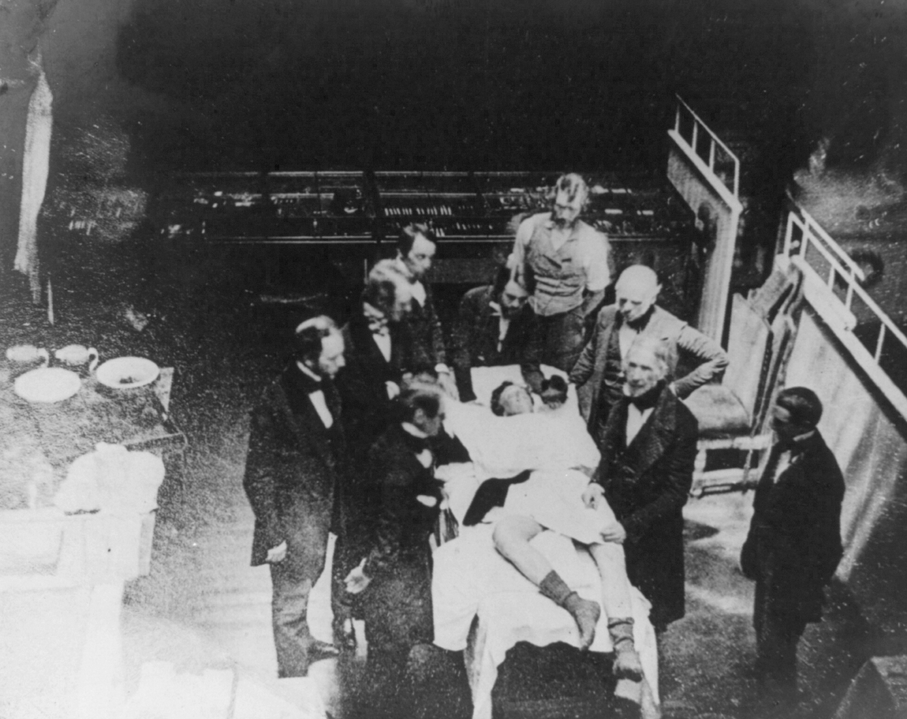

# De psychiater die maar al te graag tanden verwijderde
Dat de psychiatrie in het begin van de twintigste eeuw nog niet bepaald op punt stond, moeten we je waarschijnlijk niet vertellen. Het onderzoeksdomein wordt vooral gekenmerkt door een hele reeks twijfelachtige personages en lugubere behandelingen. Zo was er bijvoorbeeld Dr. Henry Cotton, medisch directeur in het [Trenton State Lunatic Asylum](https://www.nj.com/morris/index.ssf/2014/04/photos_see_the_nj_lunatic_asylum_some_are_fighting_to_save.html), een grote psychiatrische instelling in New Jersey. De dokter stond erom bekend zijn patiënten te behandelen door hun tanden stuk voor stuk te verwijderen.

Voor hij aan de slag ging in Trenton studeerde Cotton in Europa. Hij werd er onder andere opgeleid door [Alois Alzheimer](https://en.wikipedia.org/wiki/Alois_Alzheimer), één van de belangrijkste psychiaters van die tijd en de ontdekker van de - niet toevallig - gelijknamig ziekte. Later studeerde hij ook onder [Dr. Adolf Meyer](https://en.wikipedia.org/wiki/Adolf_Meyer_%28psychiatrist%29) in de [Johns Hopkins School of Medicine](https://en.wikipedia.org/wiki/Johns_Hopkins_School_of_Medicine), die in die tijd bekend stond als _de_ belangrijkste psychiatrische school van de Verenigde Staten.

Dr. Meyer deed onderzoek naar het effect van infecties op de psychische gezondheid. Hij observeerde dat patiënten die hoge koorts hadden, vaak hallucineerden. Daaruit concludeerde hij dat infecties - op dat moment een ultramodern veld in de geneeskunde - een biologische verklaring waren voor gedragsstoornissen. Hij ging daarmee radicaal in tegen de meer gangbare verklaringen zoals [erfelijkheid](https://nl.wikipedia.org/wiki/Erfelijkheid) en [Freud's kindertrauma's](https://nl.wikipedia.org/wiki/Psychotrauma).

Toen hij aan het hoofd kwam van het Trenton State Lunatic Asylum, zette Henry Cotton de theorie van zijn leermeester om in de praktijk. Hij behandelde zijn patiënten door hun tanden stuk voor stuk te verwijderen. Tanden onsteken immers vaak - denk maar aan abcessen - en staan in direct contact met onze hersennen. Voor Dr. Cotton dus _de_ hoofdverdachte. Als een ingreep niet efficiënt bleek te zijn, ging Dr. Cotton over op meer drastischere ingrepen. Zo verwijderde hij onder meer de teelballen, eierstokken en baarmoederhalzen van zijn patiënten. Ook galblazen, magen, milten en dikke darmen beschouwde de dokter als gevaarlijk voor de psychische gezondheid.

Ondanks het feit dat zijn behandelingen niet bijzonder succesvol waren - **45%** van zijn patiënten overleed tijdens een operatie - verkondigde Cotton toch dat ze een slaagkans van **85%** hadden. Zijn instelling had dan ook veel succes in hogere kringen, die hun psychisch onstabiele familieleden er graag lieten opnemen. De patiënten zelf waren minder fan van dokter Henry. Er werd verteld dat ze doodsbang waren voor de dokter. Ze werden dan ook vaak schreeuwend de operatiezaal binnengebracht.

Henry Cotton geloofde zo sterk in zijn techiek dat hij de tanden van zijn twee zonen preventief liet verwijderen. Zijn eigen tanden had hij nog wel toen hij stierf aan een hartaanval in 1933.

_KIJKTIP - Het verhaal van Dr. Cotton komt ook aan bod in de dramaserie ['The Knick'](https://www.imdb.com/title/tt2937900/). De serie is een leerrijke maar duistere cocktail van lugubere operaties, medische experimenten maar ook drugs, immigratie, racisme en seks die typerend was voor het begin van de twintigste eeuw. Wij zijn alvast grote fan._