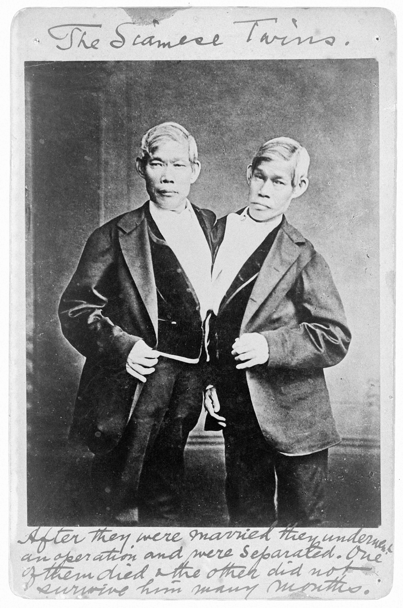

# Waar komt de term 'Siamese tweeling' vandaan?
Vanwaar komt de term 'Siamese tweeling'? Van de eerste beroemde Siamese tweeling, natuurlijk!

Chang en Eng Bunker zijn in 1811 geboren in Siam, het huidige Thailand. Ze waren aan hun middel verbonden en werden al snel bekend in de wijde omgeving. Nadat ze in 1829 ontdekt werden door een Britse handelaar, reisde de tweeling de wereld rond.

Uiteindelijk kwamen Chang en Eng in Amerika terecht, waar ze trouwden met twee zussen. Chang en zijn vrouw kregen elf kinderen, Eng en zijn vrouw kregen er tien. De beroemde tweeling stierf in 1874.

Grappig weetje: na enkele jaren samengewoond te hebben, kregen de twee vrouwen van de Siamese tweeling ruzie. De mannen besloten toen twee verschillende huizen te bouwen op hetzelfde stuk grond, voor hun twee gezinnen. Zij zelf leefden eerst een paar dagen bij de ene vrouw, dan bij de andere.