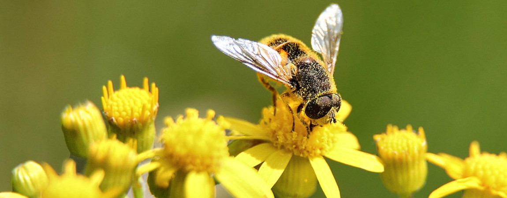

# Voortplanten in je eentje
De voortplanting is simpel: een mannetje en een vrouwtje van dezelfde soort komen samen en ze maken nakomelingen. Makkelijk! Soms kan het zelfs makkelijker – bijen, wespen en mieren hebben bijvoorbeeld geen bevruchting nodig om voor nakomelingen te zorgen. Dat kan het vrouwtje helemaal alleen.

Het resultaat van zo’n geboorte noemen we een haploïde organisme. Dat betekent dat het organisme maar één stel chromosomen heeft, in plaats van twee – en dus maar één biologische ouder. En dat komt veel vaker voor dan je zou denken.

Neem nu de bijen als voorbeeld. Wanneer een eitje niet bevrucht wordt, dan wordt er alsnog een bij geboren – dat zijn altijd mannetjes. Uit een bevrucht eitje zal altijd een vrouwtje komen. Een geboorte zonder bevruchting is dus helemaal geen uitzondering!

Uit dat feit kan je een paar leuke conclusies trekken: mannelijke bijen kunnen bijvoorbeeld nooit zonen krijgen – en ze hebben ook geen vader. Maar hun dochters kunnen wel zonen krijgen, dus de mannetjes kunnen wel kleinzonen krijgen. En ze hebben ook een grootvader.