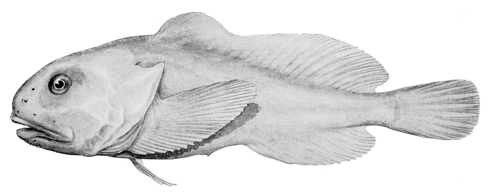

# De blobvis, toch niet zo lelijk?
De blobvis. Voor velen afschuwelijk – of net heel grappig – om naar te kijken. Vorig jaar is de blobvis officieel verkozen tot het lelijkste dier ter wereld. Terecht? Als je de foto’s ziet waarschijnlijk wel, maar er mag toch het een en ander rechtgezet worden.

Deze vreemde vis leeft vooral rond de kust van Australië – op een diepte van ongeveer een kilometer. De druk is daar zo’n 120 keer hoger dan hier op het droge. Je geraakt er dus onmogelijk zonder een hele goeie duikboot, of je zou het serieus voelen. En de blobvis voelt het dus ook, hier aan land.

Om te kunnen overleven op zo’n diepte, zijn de dieren daar heel anders gebouwd dan landdieren. Veel soorten hebben bijvoorbeeld helemaal geen skelet – dat zou de druk toch niet aankunnen. Hun lichaam wordt dus niet gevormd door botten, maar door de constante druk die op hen duwt.

Duidelijk dus dat de blobvis er helemaal anders uitziet wanneer hij op het droge wordt gehaald. En dat maakt hem natuurlijk niet knapper...