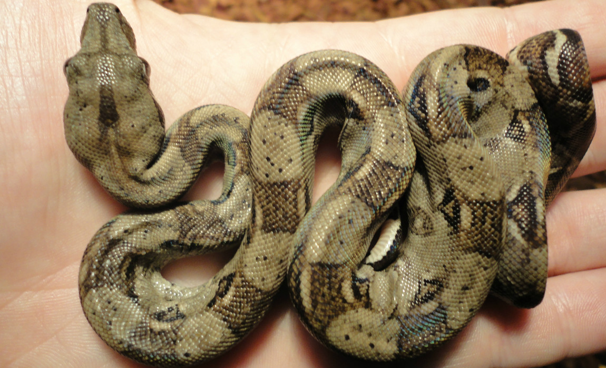

# Een vrouwelijke boa kan op haar eentje voortplanten
Een vrouwelijke boa constrictor heeft geen man in haar leven nodig - ze kan zelfs helemaal **op haar eentje voortplanten**. Researchers aan de North Carolina State University hebben een boa-moeder gevonden die twee verschillende nesten baby-slangen had gekweekt zonder vader. Opvallend: eerder had ze al kleintjes gemaakt _met_ vader.

Bij mensen hebben mannen een X- en een Y-chromosoom en vrouwen twee X-chromosomen; bij slangen is het net andersom. **Mannetjes hebben twee Z-chromosomen, vrouwtjes een Z- en een W-chromosoom.** De speciale kleintjes van deze moeder hadden van haar **twee keer het W-chromosoom** geërfd - ze zijn in feite een halve kloon van de moeder. Ze hebben exact de helft van haar genen, en niets extra. Het waren dan ook allemaal dochters.

Zo'n maagdelijke geboorte is zeker geen uitzondering in de natuur - [bij veel insecten, zoals bijen, is het zelfs heel normaal.](https://hersenvulsel.be/natuur/bijen-voortplanting-een-ouder/) Maar **bij reptielen** is het toch een uitzondering. Voor de ontdekking van dit speciale gezin, wisten we helemaal niet dat er voor slangen een andere manier van voortplanten bestond dan de traditionele manier.

Wie weet welke dieren dit nog kunnen, zonder dat wij het weten?