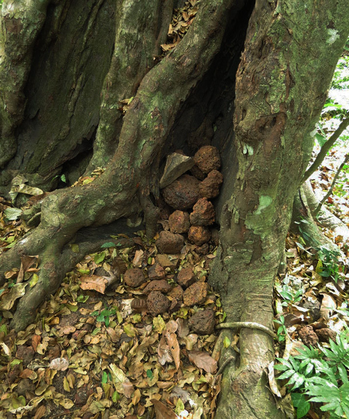

# Geloven deze chimpansees in een god?
Wetenschappers van het Max Planck Instituut voor Evolutionaire Antropologie kwamen begin deze week met een [opvallend persbericht](https://www.mpg.de/10328790/chimpanzee-stone-tree). Daarin stellen ze dat ze mogelijk voor het eerst ritueel religieus gedrag hebben waargenomen bij chimpansees in West Afrika.

De wetenschappers gebruiken al jarenlang camera's om het cultureel gedrag bij mensapen van naderbij te kunnen observeren. Op recente beelden is te zien hoe de chimpansees met stenen naar specifieke bomen gooien. Daardoor ontstaat er een grote berg stenen aan de voet van die bomen

Dat chimpansees stenen gebruiken als werktuigen weten we al langer. Toch is dit niet hetzelfde. De stapels stenen lijken geen enkel functioneel nut te hebben. De wetenschappers denken daarom dat dit wel eens een voorbeeld zou kunnen zijn van een vroege vorm van ritueel gedrag bij de dieren.

De ontdekking kan ons meer leren over het ontstaan van rituelen en religie bij de mens. De wetenschappers zien immers een duidelijke link tussen dit gedrag en gelijkaardige gebruiken in onze eigen geschiedenis. Onze voorouders stapelden bijvoorbeeld stenen op bij de graftombes van hun overleden stamgenoten. Dat gedrag staat bekend als het vroegste voorbeeld van ritueel gedrag bij de mens. Het gebruik van stenen stapels komt ook later voor bij meer gesofisticeerd ritueel-religieus gedrag. Denk maar aan [Stonehenge](https://nl.wikipedia.org/wiki/Stonehenge) en de [piramiden](https://nl.wikipedia.org/wiki/Piramide_(bouwwerk)), of de [dolmen en menhirs](https://nl.wikipedia.org/wiki/Menhir) die je ook in België kan vinden.

Laura Kehoe, één van de betrokken onderzoeksters, is alvast bezig met het vervolg van het onderzoek. Zo stelt ze: "Het markeren van wegen en gebieden met wegwijzers zoals stapels stenen was een belangrijke stap in de geschiedenis van de mens. We gaan nu onderzoeken of er een verband is tussen het territorium en de locaties waar de chimpansees hun rituelen voltrekken."

<iframe width="100%" src="https://www.youtube.com/embed/yWFZpJBqPbA" frameborder="0" allowfullscreen></iframe>