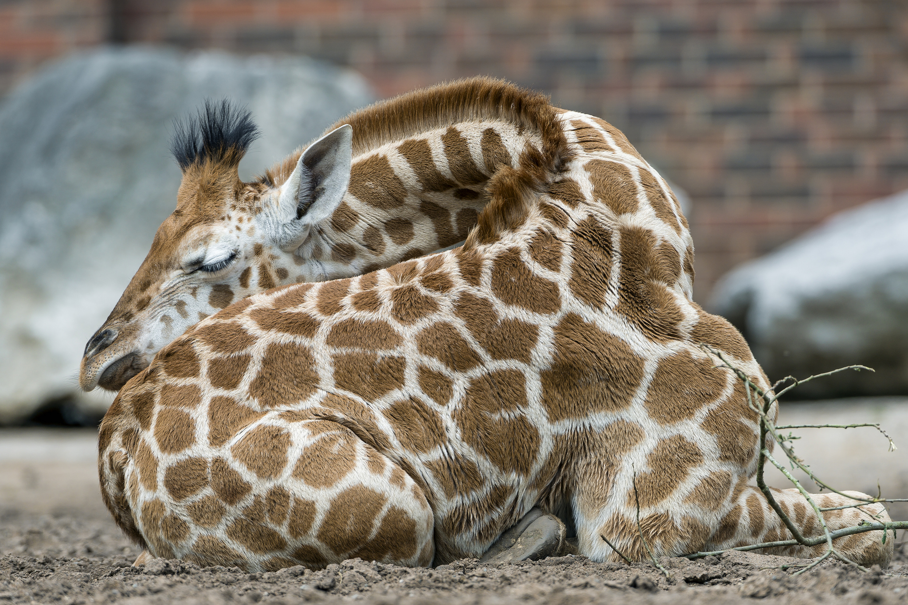

# Een giraffe slaapt maar 30 minuten per dag
Van alle dieren heeft de giraffe het minste slaap nodig. De gigantische beesten komen toe met **maar 30 minuten slaap per dag!** Gelukkig doen ze dat ook nog op een hele schattige manier.

Hoewel een volwassen giraffe **rechtop leert slapen**, doen de kleintjes het liggend. Ze leggen zich plat op de grond, poten onder hun lijf, en **met hun kop op hun kont!** Blijkbaar biedt hun achterwerk een heel zacht kussen en met die lange nek is dat natuurlijk perfect mogelijk.

Een volwassen giraffe durft zich ook al eens neerleggen, maar **zelden in het wild.** Het duurt namelijk een tijdje voor ze liggen en vooral voor ze terug rechtstaan. Zo'n slaappositie maakt van een giraffe dus **een te makkelijke prooi.**

Hoe slapen ze dan wel? **Rechtopstaand, met de ogen half open en de oren alert omhoog.** Net als sommige andere dieren kan de giraffe tijdens de slaap **deels wakker blijven**, om alert te zijn voor gevaren. Dat is ook de reden waarom ze maar **enkele minuutjes aan een stuk slapen** en dat een paar keer per dag. Met een halfuurtje slaap per dag komen ze blijkbaar toe!