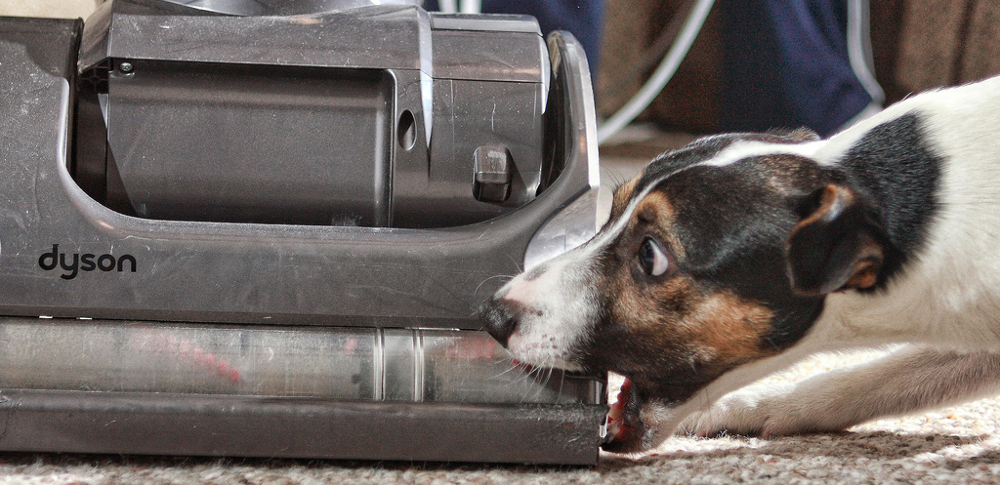

# Je hond heeft een geheugen van 2 minuten
Honden zijn vaak heel blij om hun baasjes terug te zien. Maar ze zijn dan eigenlijk allang vergeten wanneer ze je voor het laatst zagen. Honden hebben namelijk **maar een geheugen van zo’n 2 minuten!**

Het geheugen van mensen **werkt volledig anders** dan dat van andere dieren. Wij kunnen ons perfect **triviale dingen herinneren.** Waar de auto geparkeerd staat bijvoorbeeld, of langs welke weg je vorige week naar huis wandelde.

Dieren herinneren zich vooral zaken **die biologisch belangrijk zijn.** Zo zullen ze weten waar ze ooit voedsel gevonden hebben en zullen ze bang zijn van plaatsen of zaken die ze met gevaar associëren. Onbelangrijke zaken horen bij het **kortetermijngeheugen** en dat is voor de meeste dieren erg kort.

Je hond zal zich dus zeker herinneren waar zijn voederbak staat en dat hij bang is voor de stofzuiger. Wanneer je precies naar je werk vertrok, of waar jullie gisteren heen wandelden, is hij waarschijnlijk allang vergeten.