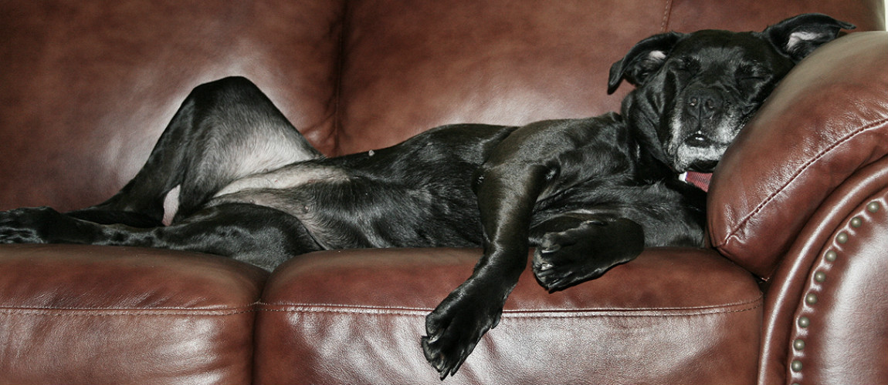

# Zo slaap ik veilig
Honden hebben vaak fantastische houdingen als ze slapen. Mooi opgekruld in de mand, of languit in de zetel, op de rug, met de poten omhoog. Wat de baasjes vaak niet weten, is dat ook de slaaphouding een vorm van lichaamstaal is. Je hond probeert je dus iets te zeggen.

Meestal slapen honden op hun buik. Het is een simpele houding: comfortabel, maar ook alert. Wanneer ze wakker worden, kunnen ze meteen de omgeving in zich opnemen. En als er gevaar is, staan ze direct op hun poten – klaar om aan te vallen of weg te lopen.

Wanneer een hond op zijn rug ligt, is dat laatste natuurlijk niet zo evident. Het zegt dan ook veel wanneer je viervoeter zo naast je ligt te slapen: hij vertrouwt erop dat zijn baasje hem ook beschermt. Je hond voelt zich dus zo veilig, dat hij niet bang is voor gevaar.

Er is echter nog een andere betekenis achter deze houding. Wanneer een hond in een roedel op zijn rug gaat liggen, betekent dat dat hij onderdanig is. Hij geeft zich dus eigenlijk aan je over – jij bent duidelijk de leider. Daarom zullen honden dit soms ook doen wanneer ze bang zijn. Maar als ze ergens liggen te snurken, zijn ze volledig op hun gemak.