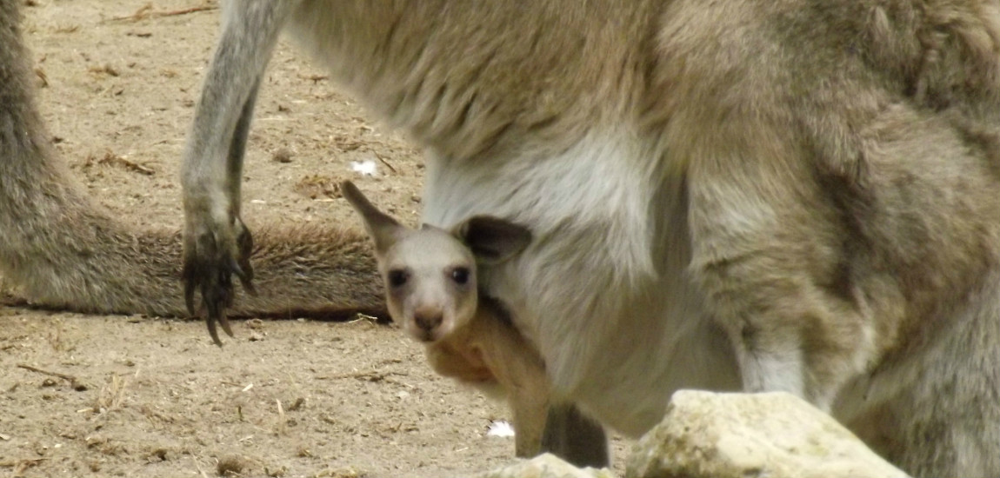

# Een kangoeroe kan constant zwanger zijn
De buidel van een kangoeroe is heel interessant. Na de geboorte leven de jongen er nog een tijd in, en zelfs wanneer ze zelfstandig rondlopen is mama’s buidel een comfortabele plaats. Veel vrouwelijke kangoeroes hebben dan ook permanent een kleintje in hun buik zitten – ze gaan van het ene naar het andere.

De voortplanting van de kangoeroe is uniek. Een jong wordt al na 33 dagen geboren: daarna verhuist het naar de buidel van de moeder. Het kleintje is op dat moment nog geen vijf centimeter groot. De buidel blijft een thuis voor het jong tot het een jaar oud is.

Pas na 110 dagen krijgt het kangoeroejong een vacht – en na 200 dagen zal het voor het eerst de buitenwereld gaan verkennen. Maar wel heel voorzichtig, want wanneer het kleintje iets onverwachts hoort of ziet, zal het snel terug in de buidel van mama springen.

Na een tijdje zal het jong definitief uit de buidel komen, maar tot het een jaar oud is blijft het moedermelk drinken. In tussentijd kan mamakangoeroe al wel een ander jong hebben – de melk moet dus gedeeld worden.

Heel vaak zijn vrouwelijke kangoeroes ‘permanent zwanger’. Een vrouwtje kan zelfs 3 generaties in de buidel hebben op hetzelfde moment. Het eerste jong kan al buiten de buidel leven, maar nog melk drinken, terwijl het tweede jong in de buidel zit – en terwijl mama zwanger is van het derde kleintje.