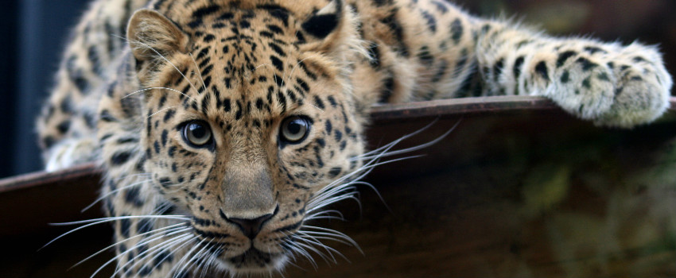

# De leopon, een kruising tussen een luipaard en een leeuwin
Er bestaat een kruising tussen een mannelijk luipaard en een leeuwin, de 'leopon'. Het beest lijkt vooral op papa luipaard, maar dan met de kop - en eventueel de manen - van een leeuw.

Leopons worden vooral geboren in dierentuinen. Volgens wetenschappers is de kans klein dat luipaarden en leeuwen in het wild ook zouden paren. Een leopon in het wild is voorlopig ook nog nooit gespot.

De meeste leopons zijn onvruchtbaar, maar heel af en toe hebben ze zelf toch ook voortgeplant. En dan wordt het nog veel gekker. We weten niet waar of wanneer, maar volgens Wikipedia heeft een mannelijke leopon weleens gepaard met een vrouwelijke liguar - een kruising tussen een leeuw en een jaguar. De welpjes werden dan leoliguars genoemd.

In theorie klinken die speciale soorten welpjes allemaal heel schattig, maar de dierentuinen die ze hebben gefokt kregen toch vooral veel kritiek. Dierenexperten vinden het niet juist om op zo'n manier met de natuur te spelen.