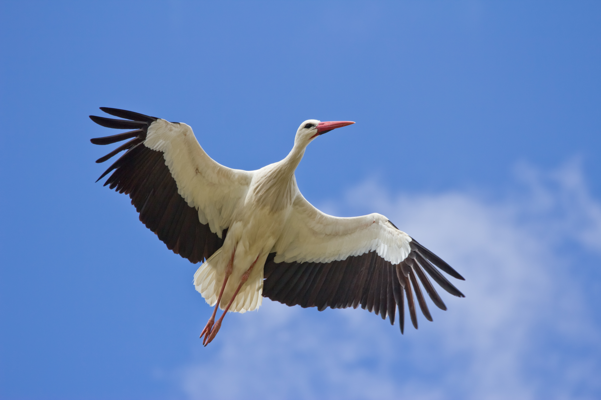

# Ooievaars overwinteren op de maan
Sommige dieren houden een winterslaap, anderen zoeken tropische oorden op. Dat weten we nu, maar enkele eeuwen geleden hadden mensen geen idee waar sommige beesten heen trokken. Zo was de 'pfeilstorch' het eerste bewijs dat vogels in de winter naar het zuiden vliegen.

Er deden vroeger verschillende theorieën de ronde over vogels. Waar gingen ze heen in de winter? Waar hielden ze zich tijdens die maanden mee bezig? De Griekse filosoof Aristoteles had rond 300 voor Christus het idee opgevat dat vogels een winterslaap hielden, diep onder water. Dat moest verklaren waarom ze nergens te zien waren.

In 1703 is er een nieuwe theorie boven water gekomen. Een pamflet uit dat jaar moest aantonen dat vogels wegvliegen om te overwinteren... naar de maan. Het jaarlijkse verdwijnen van de vogels hield de mensheid dus wel bezig, maar niemand had sluitend bewijs voor een theorie.

Dat veranderde allemaal in 1822. Na de winter werd er in Duitsland een ooievaar neergeschoten - met een geweer, maar de vogel had ook een speer in zijn nek. Het beest had in Afrika een jacht overleefd, maar had dus nog een souvenirtje mee naar huis genomen. De zogenaamde 'pfeilstorch' werd dus het bewijs dat vele vogels in de winter naar het zuiden vliegen.

Sindsdien zijn er nog zo'n 25 andere ooievaars gevonden die met pijlen van hun winterreis terugkwamen. Ze zijn allemaal opgezet en staan, samen met de originele pijlooievaar, in het museum van de universiteit van Rostock, in Duitsland.