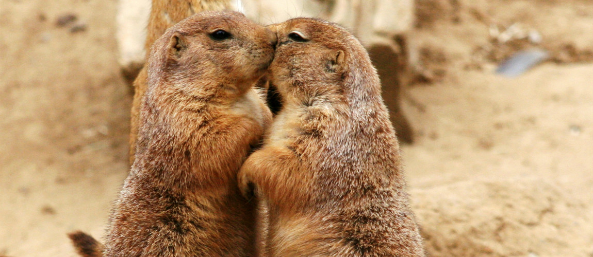

# Prairiehonden praten over ons
De prairiehond, een knaagdier uit de eekhoornfamilie, kan praten. Natuurlijk hebben alle diersoorten een manier van communiceren, maar de prairiehond heeft echt **een uitgebreide taal ontwikkeld.** En ze praten zelfs over mensen!

Dertig jaar geleden ontdekten wetenschappers dat eekhoornsoorten **verschillende waarschuwingsroepen** hebben. Als er bijvoorbeeld een vogel vanuit de lucht aanvalt, maken de beestjes een ander geluid om de groep te waarschuwen dan wanneer er een coyote komt aangeslopen. Ze vertellen elkaar dus **in detail** waar het gevaar precies vandaan komt.

De afgelopen dertig jaar is **bioloog Con Slobodchikoff** zich gaan verdiepen in de taal van prairiehonden. Hij merkte al snel op dat de beesten **verschillende 'woorden' hebben voor verschillende dieren** - een coyote kreeg een andere roep dan een hond of een mens. Maar de verschillende onderzoekers van zijn team zorgden bij de prairiehonden ook voor lichtjes verschillende geluiden. Ze hebben het dus niet over 'een mens' in het algemeen, maar over **een specifiek persoon** - net zoals wij zouden zeggen 'die man met de rode jas', gebruiken ze **verschillende klanken om iemand te omschrijven.**

Het voorbeeld van een man met een rode jas is trouwens niet zo vergezocht. Slobodchikoff ontdekte dat prairiehonden **kleuren kunnen omschrijven, vormen zoals driehoeken en cirkels en hoe groot iets of iemand is.** Ze kunnen elkaar dus perfect waarschuwen voor een man met een rode jas! Meer zelfs: prairiehonden **herinneren zich iemand die in het verleden een gevaar was** - bijvoorbeeld een mens die ze eerder al eens zagen met een jachtgeweer - en communiceren dan met elkaar **dat die persoon de vorige keer een geweer bij zich had.**

De taal is complex, maar zeer efficiënt. Slobodchikoff begrijpt nu wat de verschillende geluiden betekenen en volgens hem **zou elke mens het kunnen leren op twee uur tijd.** Om een voorbeeld te geven van de efficiëntie: een prairiehond kan in één geluid, **op één tiende van een seconde**, een mens omschrijven die lang en slank is, een blauw hemd draagt en traag voorbij de kolonie wandelt. En voor die mens valt dat korte geluid natuurlijk niet zo op!

<iframe width="100%" src="https://www.youtube.com/embed/jHjFxJVeCQs" frameborder="0" allowfullscreen></iframe>