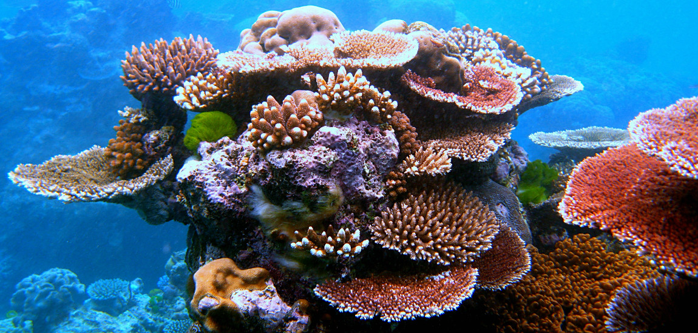

# Verhuis eens een koraalrif
In 2008 werd voor het eerst **een volledig koraalrif verplaatst.** Het was het grootste koraalrif **in Dubai**, en het moest verdwijnen om plaats te maken voor nieuwe infrastructuur - om al die natuur niet te moeten vernietigen, hebben ze het dus gewoon **opgepakt en ergens anders neergezet.**

Nu ja, gewoon... Het was een hele klus. Zo'n koraalrif is eigenlijk **één gigantisch levend organisme**, dus een verhuis kan heel gevaarlijk zijn. Koralen zelf zijn levende wezens, die zich vestigen op een zogenaamd 'kalkskelet', dat de basis vormt voor het rif. Stukje voor stukje werden de koralen dus **18 kilometer verder gezet**, maar ze moesten tijdens die verplaatsing **constant onder water blijven.** Dat dat gelukt is zonder het koraalrif te schaden, was een wereldprimeur.

Meer nog: de nieuwe locatie heeft het rif blijkbaar echt goed gedaan! Op vijf jaar tijd was de grootte ervan **toegenomen met 20 procent.** Dat kan volgens wetenschappers onder meer aan de biodiversiteit liggen - alle organismen zijn mee verhuisd, maar op die nieuwe plek leven ook **nieuwe soorten dieren en planten.** Een mooie aanvulling dus voor het rif. En daarmee weten we dan ook dat we **de natuur kunnen redden** in plaats van ze gewoon af te breken!