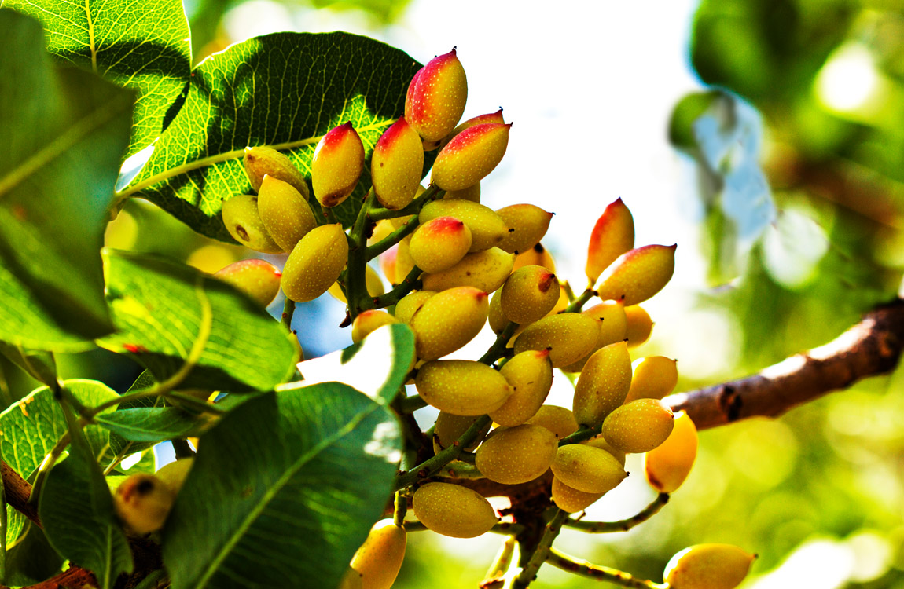
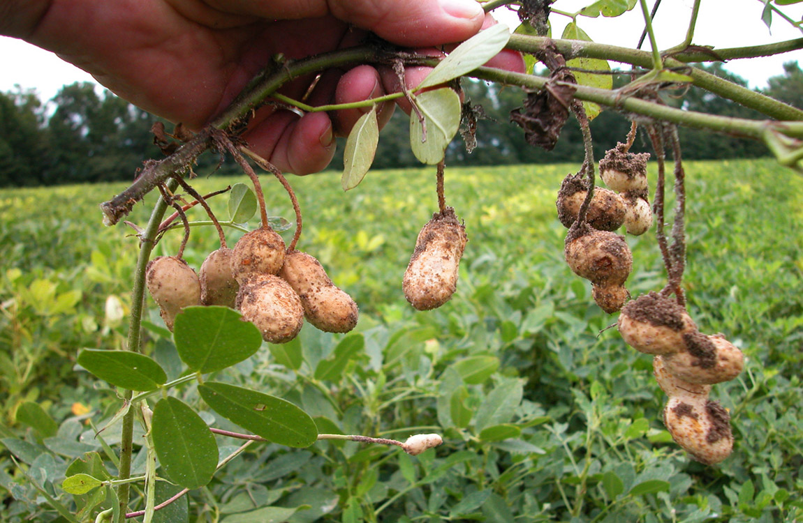
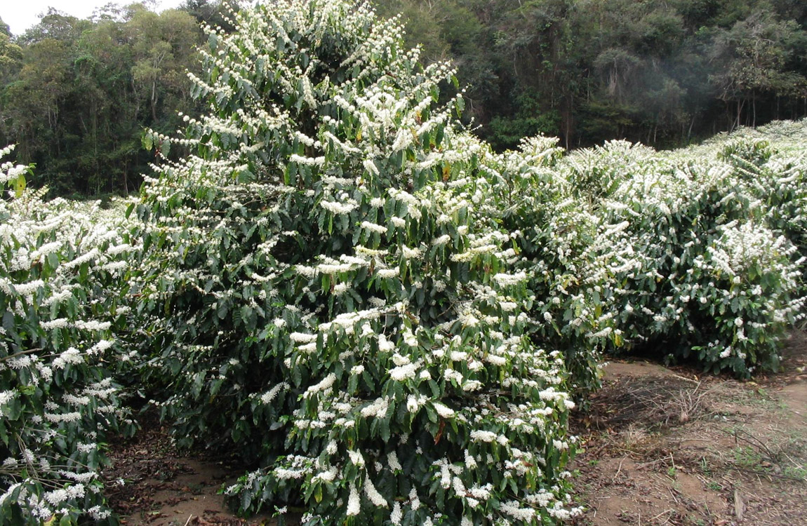
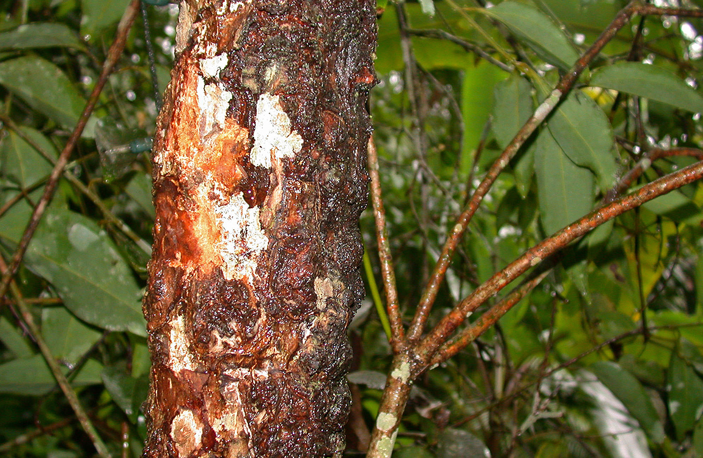
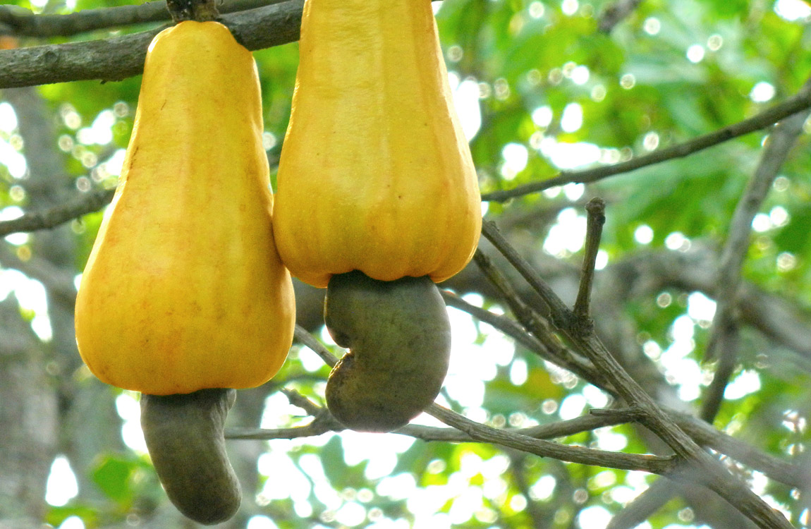
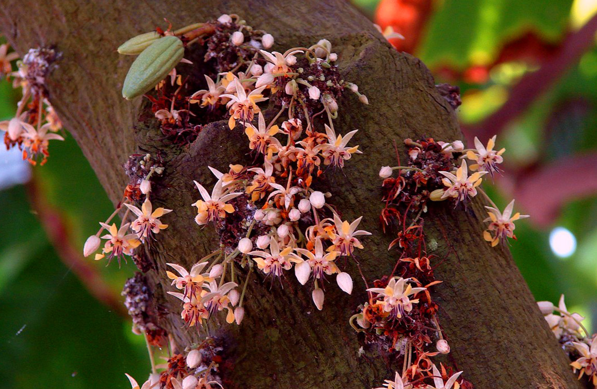

# Voedsel in bloei
Een mooie exotische bloem? Niet echt - dit zijn bananen!

De website <a href="https://www.facebook.com/brightside/">Bright Side</a> verzamelde een hele hoop foto's van de oorsprong van ons eten. Sommige foto's verbaasden ons niet echt - we weten wel hoe een ananas eruit ziet - maar andere zijn wel heel interessant om te zien!

