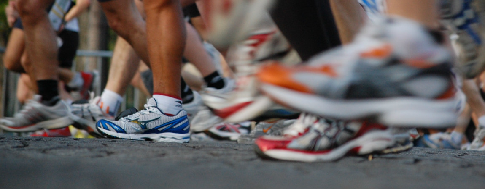

# Een op zes wordt nooit fitter
Dagelijks een halfuur sporten, gecombineerd met gezond eten, en je zal met gemak afvallen en veel fitter worden. Het klinkt makkelijk, maar sommige mensen hebben het echt moeilijk om conditie op te bouwen. Goed nieuws: het ligt misschien niet aan je doorzettingsvermogen, wel aan je genen.

Volgens recent onderzoek zou maar liefst 15% van de mensen geen resultaten bereiken met sport. Ze vallen niet af en ze worden er ook niet fitter van. Ze kunnen dus bijvoorbeeld wel een bepaalde afstand lopen, maar door te trainen kunnen ze niet langer of verder lopen: hun conditie blijft hetzelfde.

Erger zelfs: voor 3% van de mensen is sporten effectief ongezond. De onderzoekers noemen het een ‘sportallergie’: hun spieren kunnen niet genoeg zuurstof krijgen, waardoor sporten alleen maar pijn doet. Ze winnen er dus helemaal niets mee.

En zelfs wanneer je conditie wel verbetert, kan dat soms niet eens te zien zijn. Ongeveer 25% van de bevolking heeft veel moeite met het kweken van spieren. Dagelijks fitnessen heeft op deze mensen dus weinig invloed. Enige troost vinden we hier wel in: je bent niet zo ongewoon, zonder spierballen.