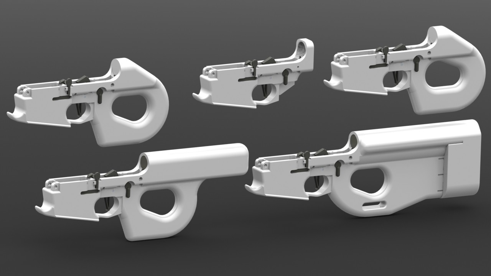
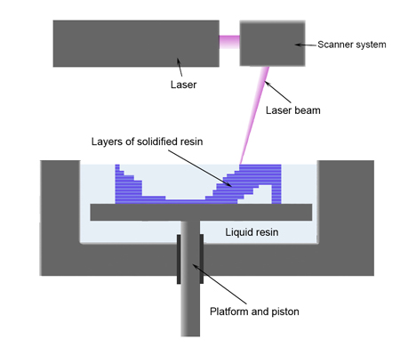
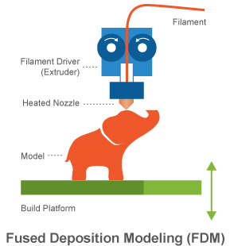
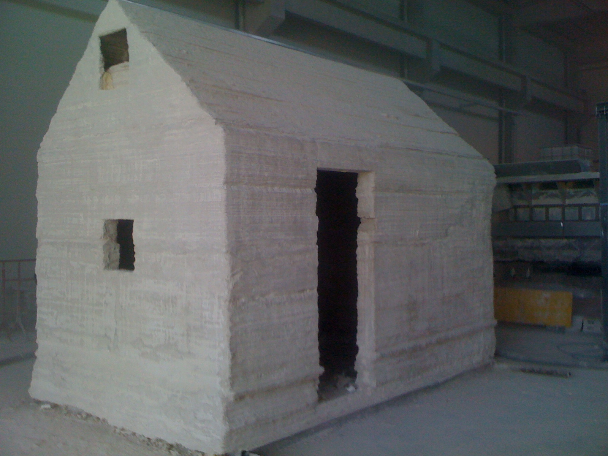

# Een huis gemaakt van zand?
Altijd al eens in een zandkasteel willen wonen? Wel, dat kan misschien binnenkort!

Het zal, helaas voor de zandbakliefhebbers onder ons, niet gemaakt zijn met plastic emmertjes en schepjes, maar **met een 3D-printer.** Jawel, een 3D-printer. _Say whut?!_

3D-printen is een opkomende vorm van productie waarbij, net zoals de Egyptenaren hun piramides bouwden, **een object laag per laag wordt opgebouwd.** Het is een techniek die sinds de jaren '70 een sterke ontwikkeling kende. Vandaag zijn er **betrouwbare 3D-printers op de markt** waarmee je de meest diverse objecten kan printen (van geweren en juwelen tot huizen) in allerlei materialen (van plastic tot metaal).

In maart 1986 werd het eerste parent voor een commercieel exploiteerbare 3D-printer verleend aan **Charles W. Hull.** Hij wordt beschouwd als de uitvinder van de 3D-printer - _maar niet van de techniek_ - omdat zijn bedrijf, 3D Systems, als eerste een commerciële machine op de markt bracht. 3D Systems is nog steeds een wereldwijd toonaangevend bedrijf in de sector.

Zijn printer maakt gebruik van de zogenaamde **stereolithografie-techniek (SLA).** Eenvoudig uitgelegd komt het hierop neer: je hebt een bak gevuld met vloeibare UV-licht-gevoelige polymeren **(kunsthars)**. Boven deze bak bevindt zich een lichtbron, **bijvoorbeeld een laser.** Die stuurt een straal naar het oppervlakte van de bak en op de plaats waar ze neerkomt, gaan de polymeren stollen. **Zo wordt dus een laag 'geprint'.** Vervolgens gaat de bak een stukje omlaag, wordt er weer een laag polymeren over de geprinte laag geplaatst en gaat de laser weer aan het werk. Gestaag wordt, laag per laag, een object opgebouwd.

Een andere populaire printtechniek is **fused deposition modelling (FDM).** Mocht je ooit al een 3D-printer aan het werk gezien hebben, dan was dat waarschijnlijk een FDM-printer. Het is de meest bekende en meest voorkomende methode in desktopprinters: de Reprap, de Ultimaker 2, de Mojo van Stratasys en vele anderen maken gebruik van deze techniek.

Bij een FDM-printer worden **thermoplasten, soorten van plastic, verhit tot een semi-vloeibare toestand.** Vervolgens wordt dat materiaal **in dunne draden**, laag per laag, op elkaar gelegd door een mobiele printerkop. **Wanneer het afkoelt, stolt het materiaal opnieuw tot plastic.** Indien nodig wordt er ook ondersteuningsmateriaal geprint dat later verwijderd kan worden. Als 'cartridge' gebruiken deze printers rollen met thermoplasten.

De Italiaanse architect en _innovator_ **Enrico Dini** zag het allemaal wat groter en ontwierp **een 3D-printer die geen plastic of metaal print, maar zand.** In samenwerking met de New Yorkse architect **Adam Kushner** besloot hij zijn uitvinding in realiteit te testen en een huis mét jacuzzi, zwembad en garage te printen.

Hoe gaat dat dan in z'n werk? Wel, de 3D-printer van Dini is geen kleintje. **Het kan objecten binnen de afmetingen van een kubus van zes op zes meter printen.** Als basismaterialen gebruikt het zand, grind en stof. De printkop van deze machine werkt bovenop een laag zand. Het laat op een bepaalde plaats, door de computer aangegeven, de deeltjes van dat zand samensmelten door middel van een chemisch proces. Daarbovenop wordt weer een nieuwe laag zand gelegd en het proces kan zich herhalen. Deze printer is dus **een combinatie van de SLA- en de FDM-techniek.** Na het stollen, krijgt het product **een marmerachtig uiterlijk.** Niet slecht!

Maar wat kunnen we hier nu eigenlijk mee? Ten eerste zou dit proces **goedkoper zijn** dan de traditionele manier om een huis te bouwen, met bakstenen en beton. Daarnaast zou de bouwfase ook **minder tijd** in beslag nemen. En tot slot - beeld je de _on demand_-mogelijkheden eens in! Met de enige beperking dat het fysiek printbaar moet zijn, kan je de wildste vormen realiseren en **je huis tot in detail aanpassen** aan al je noden of wensen.

De heren zien er ook de filantropische mogelijkheden van in. Zo denken ze aan **huisvesting voor vluchtelingen** en vele toepassingen voor **publieke infrastructuur**: van bushaltes en fonteinen tot reparaties aan oude bruggen.

Het project van architecten Dini en Kushner liep helaas wat vertraging op, maar het zou binnenkort afgerond moeten zijn. Hopelijk valt het niet als een kaartenhuis in elkaar...