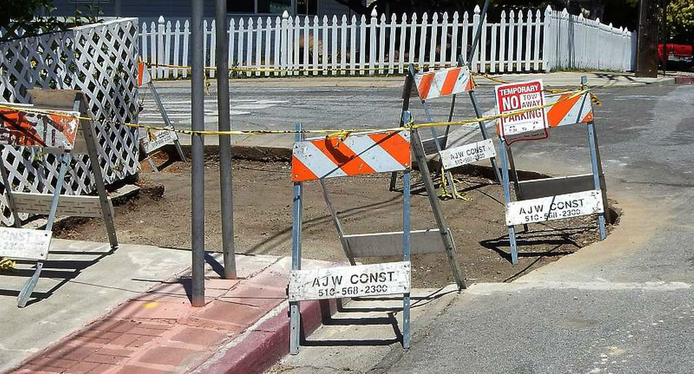

# Een wetenschappelijke stoep is per ongeluk afgebroken
Wetenschappers vinden soms verklaringen en bewijzen op hele vreemde plaatsen. De stoep, bijvoorbeeld. In **Hayward, Californië,** lag een stoeprand die **bij elke aardbeving een beetje verschoof** en zo een prachtig stukje studiemateriaal was voor wetenschappers. Tot de stad deze zomer **de stoep per ongeluk heraanlegde.**

De bewuste stoep bevond zich op de hoek tussen twee straten, Rose Street en Prospect Street. Toevallig lag de hoek van die straten **exact op de 'Hayward Fault Zone'**, een denkbeeldige lijn langs de westkust van Amerika **waar veel gevaarlijke aardbevingen plaatsvinden.** Telkens wanneer er zo'n aardbeving was, kon je daarna het verschil zien aan de stoeprand. Door de jaren heen was er een grote kloof ontstaan.

Sinds de jaren '70 was die straathoek een prachtfenomeen voor wetenschappers, tot deze zomer dus. **Het stadsbestuur had er blijkbaar geen idee van** dat er zich op hun gebied zo'n speciale stoep bevond. Omdat de kloof op de hoek zo groot was geworden, besloten ze de stoep te **repareren.** Tot grote spijt van wetenschappers wereldwijd.